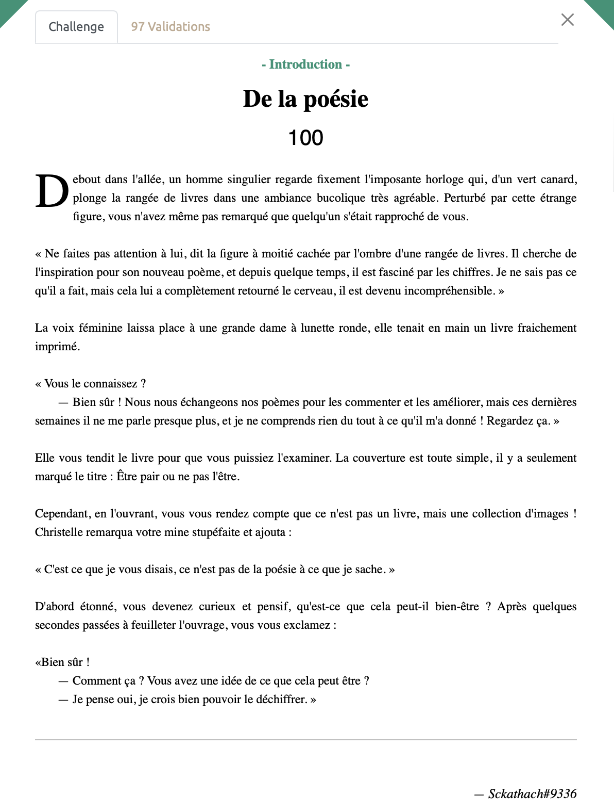
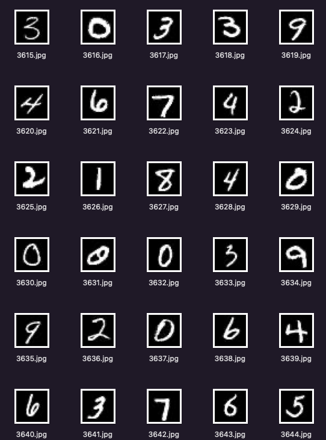

# De la poésie - intro, 100 points

***

Nous avons un ensemble de 6535 images de taille 28x28 à notre disposition qui proviennent du [MNIST dataset](https://fr.wikipedia.org/wiki/Base_de_données_MNIST). Il s'agit d'image représentant des chiffres écrits à la main. 

Vu le nombre important d'images, nous allons utiliser un algorithme de classification (utilisant des CNN - une technique de ML) pour classifier les images. Grâce à [ce programme](https://github.com/arpita739/MNIST-Handwritten-Digit-Recognition-using-CNN), on obtient ainsi une séquence de chiffres que l'on va pouvoir analyser. 

Problème, on a une séquence de plus de 6500 chiffres qui ne semblent correspondre à rien. C'est en relisant l'énoncé plusieurs fois que l'on s'arrête sur la phrase "être pair ou ne pas l'être". Suprenant ... Faudrait-il convertir cette séquence de chiffres en binaire (en associant à chaque valeur un 0 ou à un 1 en fonction de si elle est paire ou non).

Et en effet, en donnant à Cyberchef la séquence de binaire obtenu, on obtient au milieu de la prose:
> 404CTF{d3_L4_p03S1e_qU3lqU3_@3u_C0nU3mp0ò4hn3}

Tiens donc ça ressemble à un flag, mais on dirait que quelques caractères déconnent. Eh oui, rien de surprenant, on a utilisé un algorithme de machine learning qui fait de son mieux pour reconnaitre les chiffres mais n'a pas une accuracy de 100%.

C'est là que les galères commencent, il faut alors se plonger dans les valeurs pour vérifier manuellement si elles ont bien été trasncrites par l'algorithme. Heureusement, maintenant que l'on a décoder l'essentiel du texte, on sait où se cache le flag au milieu des 6500 images, et on n'a besoin de vérifier qu'une petite partie de toutes ces valeurs mais ca reste bien bien fastidieux, sachant qu'il faut 8 images pour obtenir 8 bits qui correspondent à un unique caractère du flag !

Après bien des efforts, on obtient notre flag ! 

Voir le flag :

***FLAG:  404CTF{4rR3tE_De_m_e$pi0Nn3R}***

