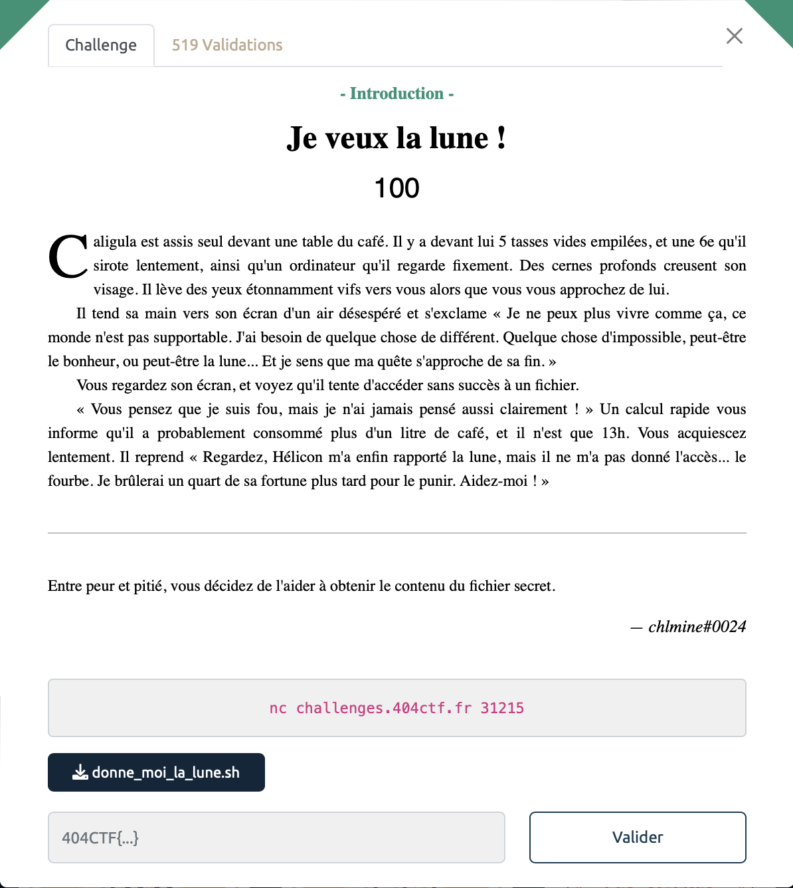

# Je veux la lune - Intro, 100 points



***

On a un script shell à notre disposition:

```sh

#!/bin/bash
​
Caligula=Caius
​
listePersonnes="Cherea Caesonia Scipion Senectus Lepidus Caligula Caius Drusilla"
​
echo "Bonjour Caligula, ceci est un message de Hélicon. Je sais que les actionnaires de ton entreprise veulent se débarrasser de toi, je me suis donc dépêché de t'obtenir la lune, elle est juste là dans le fichier lune.txt !
​
En attendant j'ai aussi obtenu des informations sur Cherea, Caesonia, Scipion, Senectus, et Lepidus, de qui veux-tu que je te parle ?"
read personne
eval "grep -wie ^$personne informations.txt"
​
while true; do
    echo "De qui d'autre tu veux que je te parle ?"
    read personne
​
    if [ -n $personne ] && [ $personne = "stop" ] ; then
    exit
    fi
​
    bob=$(grep -wie ^$personne informations.txt)
    
    if [ -z "$bob" ]; then
        echo "Je n'ai pas compris de qui tu parlais. Dis-moi stop si tu veux que je m'arrête, et envoie l'un des noms que j'ai cités si tu veux des informations."
    else
        echo $bob
    fi  
​
done
```

Le script recherche les lignes contenant le mot saisi, sans tenir compte de la casse, dans le fichier informations.txt (via les options -wie du grep).

On voit tout de suite que le problème vient de l'utilisation de `eval` qui ne "sanitize" pas les inputs. 

On va ainsi pouvoir injecter la commande que l'on veut pour obtenir le flag qui est contenu dans le fichier `lune.txt`. Par exemple en profitant du grep déjà présent:

`404CTF ./*`

ou encore:
`blabla lune.txt; cat lune.txt;#`

On utilise un # pour commenter la fin de la ligne pour ne pas avoir de problèmes, tout comme on pourrait le faire pour une injection SQL. 

<details>
<summary>Voir le flag :</summary>

***FLAG: 404CTF{70n_C0EuR_v4_7e_1Ach3R_C41uS}***
</details>


