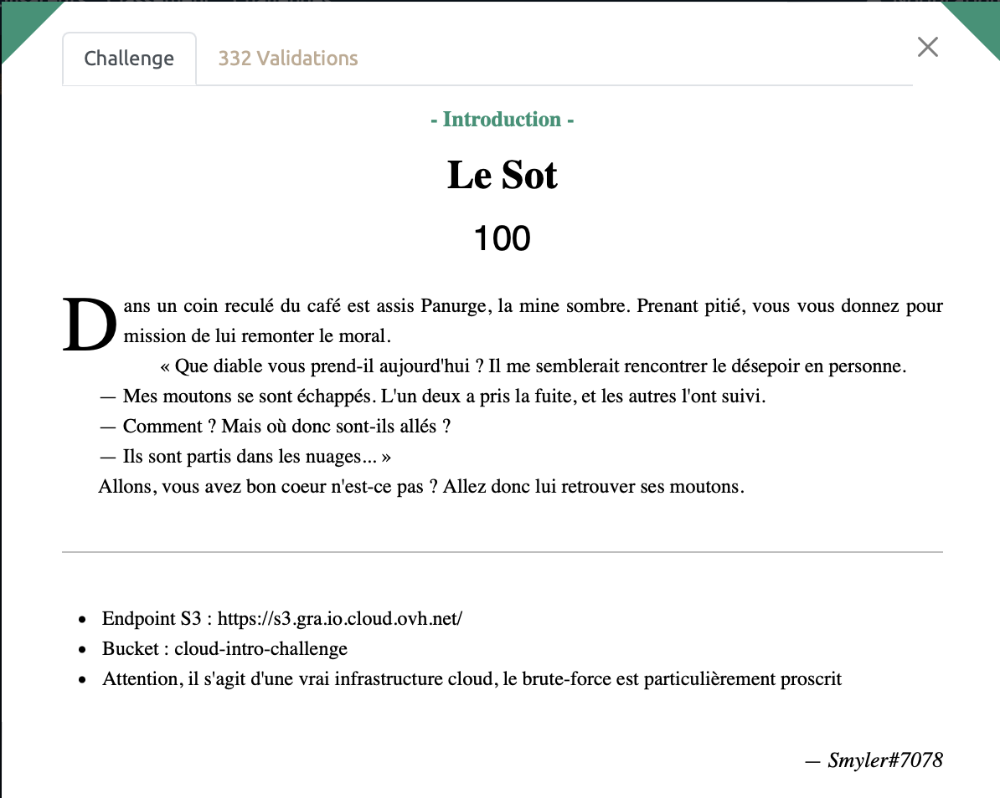

# Le Sot - Intro, 100 points




N'ayant pas vraiment de connaissances en cloud, je suis allé lire la [doc AWS](https://docs.aws.amazon.com/AmazonS3/latest/userguide/WebsiteEndpoints.html) sur internet. 

Pour accéder au Bucket "cloud-intro-challenge" stocké sur le endpoint s3 `https://s3.gra.io.cloud.ovh.net`, on accède à
https://cloud-intro-challenge.s3.gra.io.cloud.ovh.net/

On obtient alors un fichier XML dans lequel il est fait mention d'un fichier nommé `les-moutons.json`. 

Il ne reste alors plus qu'à accéder à ce fichier en tapant dans l'URL https://cloud-intro-challenge.s3.gra.io.cloud.ovh.net/les-moutons.json. 

Ou alors dans le terminal :
```sh
$ curl https://cloud-intro-challenge.s3.gra.io.cloud.ovh.net/les-moutons.json
{
    "sheeps": [
        {
            "name": "Ivy",
            "canSwim": false,
            "canFly": false,
            "sex": "male",
            "treat": "follower"
        },
        {
            "name": "Sweetie",
            "canSwim": false,
            "canFly": false,
            "sex": "female",
            "treat": "follower"
        },
        {
            "name": "Pine",
            "canSwim": false,
            "canFly": false,
            "sex": "male",
            "treat": "follower"
        },
        {
            "name": "Cinnamon",
            "canSwim": false,
            "canFly": false,
            "sex": "male",
            "treat": "follower"
        },
        {
            "name": "Shaggy",
            "canSwim": false,
            "canFly": false,
            "sex": "female",
            "treat": "follower"
        },
        {
            "name": "Khaki",
            "canSwim": false,
            "canFly": false,
            "sex": "female",
            "treat": "follower"
        },
        {
            "name": "Sugar",
            "canSwim": false,
            "canFly": false,
            "sex": "male",
            "treat": "follower"
        },
        {
            "name": "Sponge",
            "canSwim": true,
            "canFly": true,
            "sex": "female",
            "treat": "leader"
        },
        {
            "name": "Flufkins",
            "canSwim": false,
            "canFly": false,
            "sex": "demale",
            "treat": "follower"
        },
        {
            "name": "Ruth",
            "canSwim": false,
            "canFly": false,
            "sex": "male",
            "treat": "follower"
        }
    ],
    "flag": "404CTF{D35_m0utOns_D4n5_13s_NU@g3s}"
}
```

<details>
<summary>Voir le flag :</summary>

***FLAG: 404CTF{D35_m0utOns_D4n5_13s_NU@g3s}***
</details>


