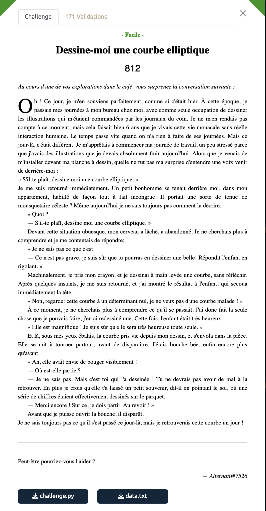

# Dessine-moi une courbe elliptique - Facile, 812 points



Nous avons à notre disposition [un fichier python](./challenge.py) et la [sortie de ce programme](./data.txt) après avoir été exécuté. 

Grâce à toutes ces données on peut retrouver les valeurs a et b qui ont été cachées dans le fichier python et ainsi déchiffrer le message secret.

Voici les données et les formules utilisées pour faire cela:


```python
p = 231933770389389338159753408142515592951889415487365399671635245679612352781
xg = 93808707311515764328749048019429156823177018815962831703088729905542530725
yg = 144188081159786866301184058966215079553216226588404139826447829786378964579
xh = 139273587750511132949199077353388298279458715287916158719683257616077625421
yh = 30737261732951428402751520492138972590770609126561688808936331585804316784

a = (yg**2 - yh**2 + xh**3 - xg**3) * pow(xg-xh, -1, p) %p
b =( yh**2 - xh**3 - a*xh )%p
```

On peut alors décriper le ciphertext présent dans le fichier data.txt. On prend aussi le soin de récupérer la valeur de iv qui est aussi dans data.txt.

```python
iv=bytes.fromhex("00b7822a196b00795078b69fcd91280d")
cipher=bytes.fromhex("8233d04a29befd2efb932b4dbac8d41869e13ecba7e5f13d48128ddd74ea0c7085b4ff402326870313e2f1dfbc9de3f96225ffbe58a87e687665b7d45a41ac22")

aes = AES.new(sha1((str(a)+str(b)).encode()).digest()[:16], AES.MODE_CBC, iv=iv)
plain = aes.decrypt(cipher)
print(plain)
````


Et c'est ainsi que l'on obtient notre flag.

<details>
<summary>Voir le flag :</summary>

***FLAG: 404CTF{70u735_l35_gr4nd35_p3r50nn3s_0nt_d_@b0rd_373_d35_3nf4n7s}***
</details>

