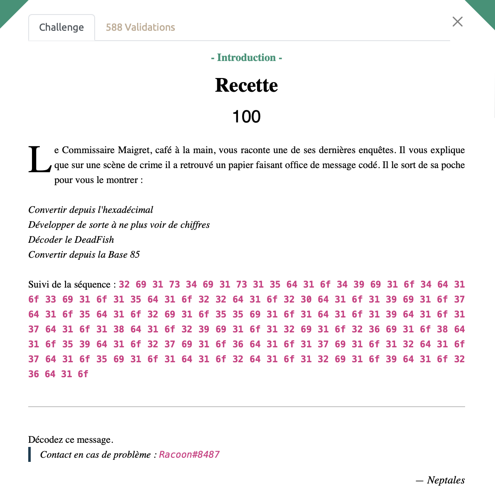

# Recette - intro, 100 points

> 32 69 31 73 34 69 31 73 31 35 64 31 6f 34 39 69 31 6f 34 64 31 6f 33 69 31 6f 31 35 64 31 6f 32 32 64 31 6f 32 30 64 31 6f 31 39 69 31 6f 37 64 31 6f 35 64 31 6f 32 69 31 6f 35 35 69 31 6f 31 64 31 6f 31 39 64 31 6f 31 37 64 31 6f 31 38 64 31 6f 32 39 69 31 6f 31 32 69 31 6f 32 36 69 31 6f 38 64 31 6f 35 39 64 31 6f 32 37 69 31 6f 36 64 31 6f 31 37 69 31 6f 31 32 64 31 6f 37 64 31 6f 35 69 31 6f 31 64 31 6f 32 64 31 6f 31 32 69 31 6f 39 64 31 6f 32 36 64 31 6f

Rien de bien sorcier ici, il suffit de suivre les instructions à la lettre. 

Tout d'abord nous [convertissons depuis l'héxadécimal](https://www.rapidtables.com/convert/number/hex-to-ascii.html) pour obtenir:
>2i1s4i1s15d1o49i1o4d1o3i1o15d1o22d1o20d1o19i1o7d1o5d1o2i1o55i1o1d1o19d1o17d1o18d1o29i1o12i1o26i1o8d1o59d1o27i1o6d1o17i1o12d1o7d1o5i1o1d1o2d1o12i1o9d1o26d1o

Il faut ensuite "développer de sorte à ne plus voir de chiffres", c'est sans doute la seule subtilité ici, en réalité, il faut multiplier chaque charactère par l'entier qui le précède (par example '5a' devant 'aaaaa')

On obtient ainsi grâce à ce petit [script](./recette_develop.py):
> iisiiiisdddddddddddddddoiiiiiiiiiiiiiiiiiiiiiiiiiiiiiiiiiiiiiiiiiiiiiiiiioddddoiiiodddddddddddddddoddddddddddddddddddddddoddddddddddddddddddddoiiiiiiiiiiiiiiiiiiiodddddddodddddoiioiiiiiiiiiiiiiiiiiiiiiiiiiiiiiiiiiiiiiiiiiiiiiiiiiiiiiiiododddddddddddddddddddodddddddddddddddddoddddddddddddddddddoiiiiiiiiiiiiiiiiiiiiiiiiiiiiioiiiiiiiiiiiioiiiiiiiiiiiiiiiiiiiiiiiiiioddddddddodddddddddddddddddddddddddddddddddddddddddddddddddddddddddddoiiiiiiiiiiiiiiiiiiiiiiiiiiioddddddoiiiiiiiiiiiiiiiiioddddddddddddodddddddoiiiiiododdoiiiiiiiiiiiiodddddddddoddddddddddddddddddddddddddo

Enfin on décode le Dfish sur ce [site](https://www.dcode.fr/deadfish-language) pour obtenir cette séquence ASCII:
> 1b^aR<(;4/1hgTC1NZtl1LFWKDIHFRI/

Il ne reste alors plus qu'à convertir depuis la base85 avec [Cyberchef](https://gchq.github.io/CyberChef/) pour obtenir notre sésame.

Voir le flag :

***FLAG: 404CTF{M4igr3t_D3_c4naRd}***

