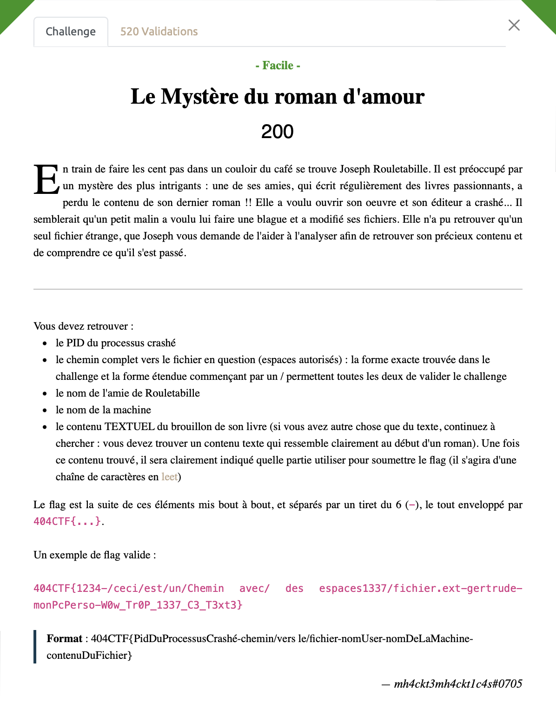
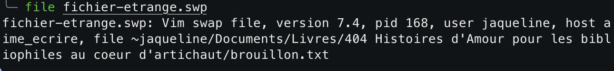

# Le Mystère du roman d'amour - Facile, 200 points



On part d'un [fichier-étrange.swp](./fichier-etrange.swp).

Énigmatique ce fichier, on fait fait donc un `file` pour en savoir un peu plus:




Voilà de quoi nous ravir, on y trouve les informations utiles suivantes:
- Le PID : 168
- L'utilisateur : jaqueline
- Le nom de la machine : aime_ecrire
- Le chemin relatif du fichier : ~jaqueline/Documents/Livres/404 Histoires d'Amour pour les bibliophiles au coeur d'artichaut/brouillon.txt

Reste maintenant à trouver le contenu TEXTUEL du fichier. 
Pour cela, maintenant que l'on sait qu'il s'agit d'un fichier swap vim, on utilise la command suivcante: 

```bash
vim -r fichier-etrange.swp
```

On découvre alors cette image PNG qui était contenue dedans notre fichier:


Surprenante cette image, et si elle cachait quelque chose. On cherche un peu partout dans l'image et finalement en trafiquant un peu la balance des couleurs de notre PNG avec `GIMP` on obtient l'image suivante: 


Tiens donc un QR code, plus qu'à le scanner avec notre application favorite pour découvrir le message qui y est caché. On découvre ainsi que le contenu du fichier est 3n_V01L4_Un_Dr0l3_D3_R0m4N.

La boucle est bouclée, plus qu'à assembler tout ca pour obtenir notre (long) flag.

<details>
<summary>Voir le flag :</summary>

***FLAG:  404CTF{168-~jaqueline/Documents/Livres/404 Histoires d'Amour pour les bibliophiles au coeur d'artichaut/brouillon.txt-jaqueline-aime_ecrire-3n_V01L4_Un_Dr0l3_D3_R0m4N}***
</details>