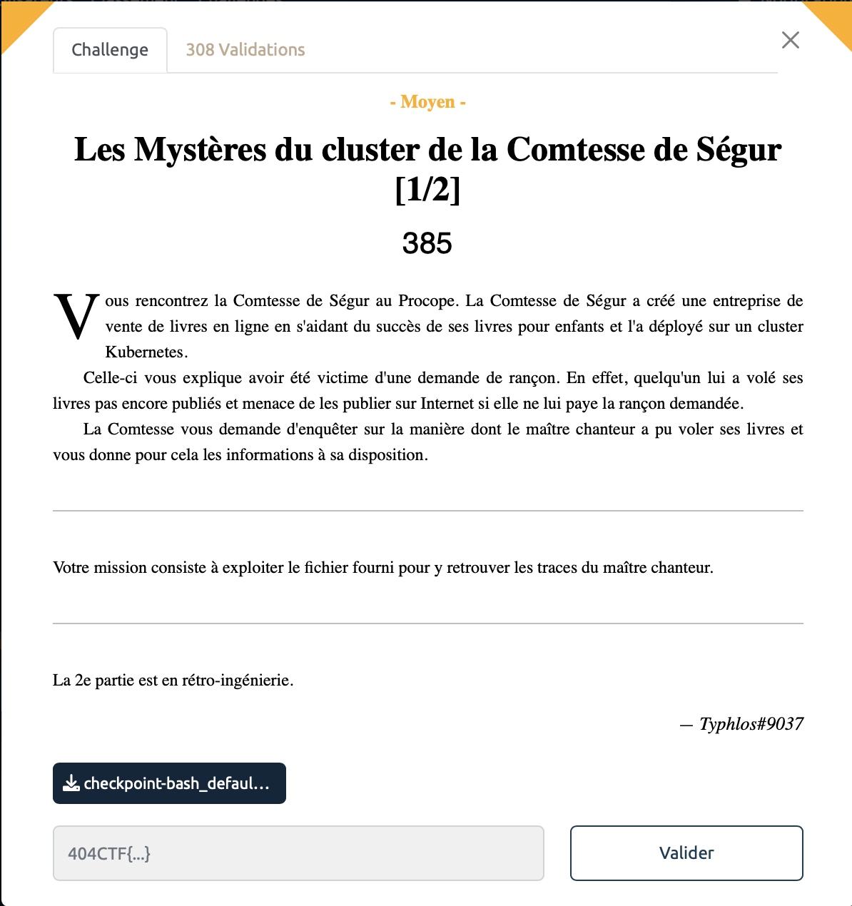
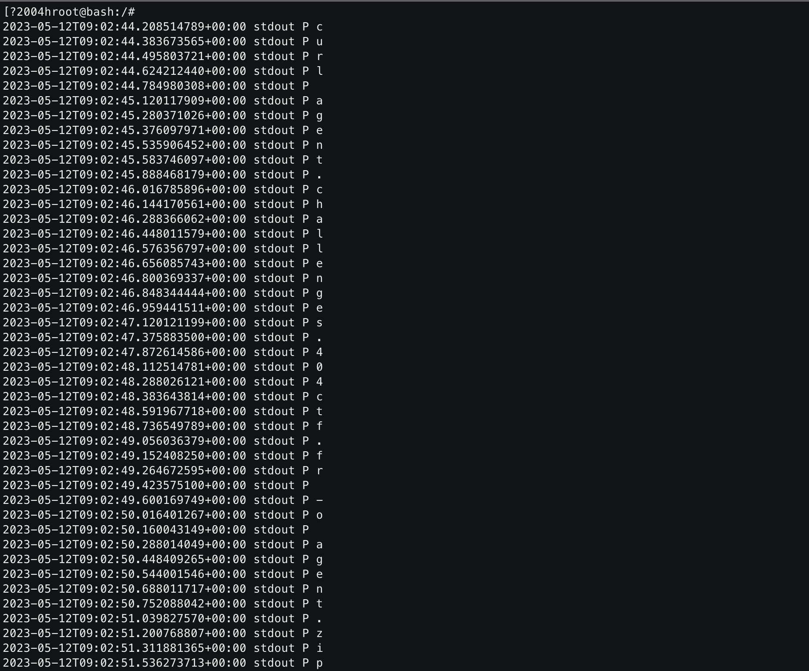

# Les mystères du cluster de la Comtesse de Ségur - Moyen, 385 points



Dans ce challenge, nous avions à disposition [une archive](./checkpoint-bash_default-bash-2023-05-12T09-04-21Z/) contenant des logs et des dumps de la machine d'une victime.

On fouille un peu partout dans les fichiers sans trouver rien de bien probant jusq'à arriver sur ce fameux fichier, `io.kubernetes.cri-o`. 

Ce fichier retrace tout ce qui a été exécuté par la machine qui est un cluster Kubernetes. 

En exécutant la commande `strings io.kubernetes.cri-o.LogPath` on tombe assez vite sur ça:



Étonnnant ce `curl` dont l'output est enregistré dans le fichier `agent.zip`. 

À notre tour de faire tourner cette fameuse commande, peut-être que l'on va trouver notre bonheur dans le fichier `agent.zip` (en réalité pas vraiment de doute, il est fait mention d'un fichier flag.txt un chouïa plus loin dans le fichier log, mais bon no spoil comme on dit).

Alors c'est parti:

```sh
$ curl https://agent.challenges.404ctf.fr/ -o ca_sent_le_flag.zip
$ unzip ca_sent_le_flag.zip
```
Tiens donc on vient d'extraire un fichier `flag.txt`, il ne reste plus qu'à faire un petit `cat` pour trouver notre bonheur. 


<details>
<summary>Voir le flag :</summary>

***FLAG: 404CTF{K8S_checkpoints_utile_pour_le_forensic}***
</details>