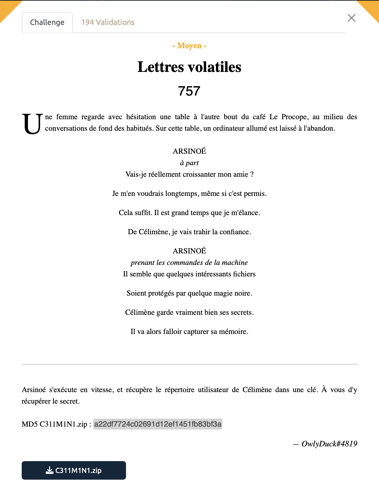
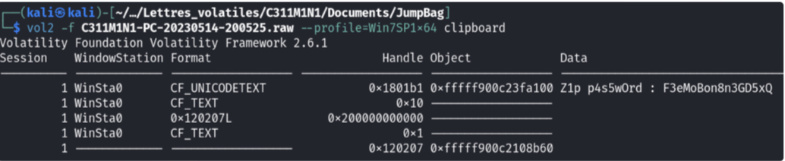
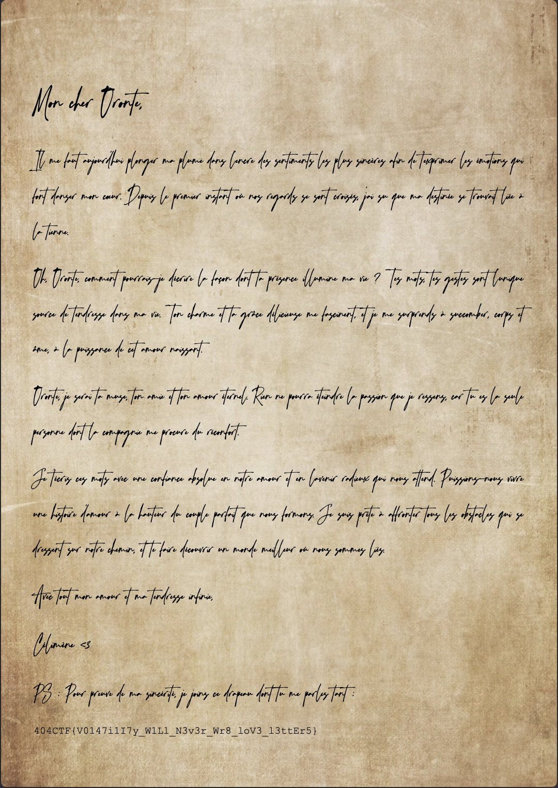

# Lettres volatiles - Moyen, 757 points



***

Le titre du challenge ne laisse pas planer beaucoup de doûtes, il va falloir utiliser le célèbre outil de Forensics [Volatility](https://github.com/volatilityfoundation/volatility) qui permet de faire efficacement de l'analyse mémoire . Ne perdez pas votre temps comme moins à chercher partout le flag avec Volatility 3, il faut utiliser Volatility 2 qui a pleins de fonctions/plugins pas encore disponibles chez son sucesseur. 

Nous avons un dump mémoire à notre disposition dans lequel on va pouvoir fouiller un peu. On cherche ainsi des pistes dans les différents repertoires Images, Téléchargements, Documents,...

Dans Images on trouve un paquet de choses, des images du CTF, des photos de drapeau blanc, beaucoup de références à notre cher et tendre [Rick Astley](https://www.youtube.com/watch?v=dQw4w9WgXcQ), pas de doute on se moque de nous il faut aller chercher autre part. 

Assez vite on tombe sur le fichier [s3cr37.zip](./s3cR37.zip) dans le dossier /Documents/perso qui requiert un mot de passe (ce fichier ZIP contient un PDF bien suspicieux). Petit malin que je suis je lance alors `hashcat` pour essayer de le bruteforce, sans grand succès en 45 minutes. Bon, il va falloir être un peu plus malin...

Après tout, le challenge fait référence à l'outil `Volatility`, il serait peut-être temps de mettre les mains dans le cambouis. 

En cherchant encore un peu, on tombe sur un dossier jumpbag qui d'après Google, sert à dump la ram. On y trouve un fichier à l'intérieur un énigmatique fichier `.raw`. Voici sans doute la clé de voute de ce challenge !

Partons à la recherche d'un mot de passe pour notre fichier zip. Je vous épargne les longues analyses de tous les process et le temps passé à analyser l'activité sur Mozilla ou le notepad, ca ne mène nul part. On finit par regarder ce qu'il se cache dans le clipboard (au cas où notre pauvre victime aurait eu la bonne(?) idée de copier-coller le mot de passe de ce fameux fichier zip). On procède ainsi:

```sh
# On récupère d'abord des informations sur 
# le type d'OS utilisé grâce à cette commande
$ vol2. -f <image.raw> imageinfo

# On peut alors dump le contenu du clipboard 
# grâce à cette commande
$ vol2 -f <image.raw> --profile Win7SP1 clipboard

```

Et effectivement on fait mouche :



Voici de quoi décompresser notre fameux ZIP (pas de regrets d'avoir rapidement abandonné `hashcat`, vu la taille du mot de passe, mon pauvre PC serait sans doute encore en train de tourner pendant la prochaine édition du 404CTF). 

On décompresse notre fichier grâce au mot de passe tout juste découvert et on découvre cette lettre d'amour compromettante de Célimène (et le flag, mais c'est anecdotique ça).




<details>
<summary>Voir le flag :</summary>

***FLAG: 404CTF{V0147i1I7y_W1Ll_N3v3r_Wr8_loV3_l3ttEr5}***
</details>


