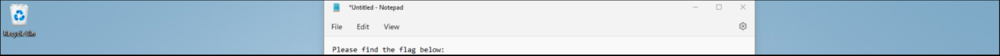

# Note de bas de page - Difficile, 954 points


***

Contexte:
>Ce challenge m'a fait subir une PTSD de [Insomnihack](https://www.insomnihack.ch) (un CTF en Suisse s'étant déroulé quelques semaines plus tôt) où j'ai passé une (trop) grande partie de la nuit sur un challenge tout à fait analogue. C'était un grand plaisir de ressortir tout ça et de flagger en un rien de temps.

On part d'un énigmatique fichier [backup.pst](./backup.pst). On run donc la commande `file` pour en savoir un peu plus sur sa nature.


Il s'agit d'une sauvegarde Outlook. Il peut être ouvert directement avec Outlook, ou avec pffexport (paquet pff-tools sur Ubuntu). 

Ravi de faire ce challenge en quelques secondes en récupérant le script que j'avais adapté depuis celui de acropalypse pour qu'il fonctionne non plus pour du RGB mais pour du RGBA qui est utilisé ici. Pas le temps de me saouler avec ces bêtises néanmoins, j'utilise donc cet [outil en ligne](https://goldfynch.com/pst-viewer/) pour analyser le contenu du fichier. 


C'est en regardant le contenu de cette boite mail que l'on tombe très vite sur ce mail contenant une pièce jointe. En la regardant de plus près on découvre un morceau de flag en bas à droite. 


Malheureusement, le flag n'est qu'en partie visible car l'image a été rognée. 
Cependant en analysant le contenu hexadécimal du fichier avec `xdd croped_image.png | less`, on se rend compte qu'après la première occurence de "IEND" qui signifie normalement la fin des données d'un fichier PNG, il y'a encore un paquet de données, jusqu'à une deuxième occurence du "IEND". Comme si l'image avait été rognée mais que les données de l'image en dehors de la partie cropped n'apparaissait pas dans un visionneur d'image mais étaient toujours stockées dans le fichier.

`Exiftool` nous indique également qu'il y'a des données après le fameux IEND chunk ce qui est franchement suspect.


Voici la structure d'un fichier PNG, en espérant que cela rende un peu plus clair le paragraphe ci-dessus.


Reviennent alors des souvenirs douloureux d'heures entières passées à essayer de réassembler manuellement les chunks de data, le header, les checksums et tout le tralala pendant Insomnihack pour faire exactement la même chose.

En réalité, il s'agit d'une recette faille nommée [Acropalypse](https://twitter.com/David3141593/status/1638222624084951040) (CVE-2023-21306) découverte par David Buchanan. Certains téléphone Google Pixel ont été vulnérables et c'est également le cas de l'outil capture d'écran de Windows 11 (patché depuis). 

Allez on se laisse pas abattre et on enchaîne avec un peu d'OSINT (après tout c'était une catégorie maitresse pendant ce CTF). On tombe alors sur un post Twitter de notre ami David qui nous mène sur [ce repo gist](https://gist.github.com/DavidBuchanan314/93de9d07f7fab494bcdf17c2bd6cef02). On y découvre un script python permettant de *uncrop* une image vulnérable à cette faille.

Bingo me direz-vous. Eh ben non, figurez vous que ca ne s'arrête pas là, ce petit script fonctionne uniquement pour les images RGB hors notre capture d'écran utilise du RGBA. Bref, il faut maintenant modifier ce charmant script pour qu'il prenne en compte également le channel alpha. 
On demande un petit coup de pouce à GPT et avec nos 3 neurones restants, on obtient ce [script](./uncrop.py).

Plus qu'à essayer notre petit programme. On suggère que la résolution initiale de l'image est 1920x1080 (la 1080p étant la résolution la plus répandue aujourd'hui).

```sh
$ python3 uncrop.py 1920 1080 cropped.png uncropped.png
```

Et là, surprise, on obtient cette merveilleuse image reconstituée. 


Fantastique, n'est pas ! 
Petite pensée pour Microsoft, toujours au top pour nous offrir des failles plus croustillantes les unes que les autres. Merci à eux et merci aux créateurs pour ce challenge fun et au goût du jour ! 

<details>
<summary>Voir le flag :</summary>

***FLAG: 404CTF{V0147i1I7y_W1Ll_N3v3r_Wr8_loV3_l3ttEr5}***
</details>

***

> En réalité, il est a noter que pas mal d'articles ont été publiés depuis Mars, moment où j'avais fait ce challenge pour la première fois. Il y'a aujourd'hui des outils en ligne clé en main pour résoudre ce challenge assez aisément. Mais bon je trouvais plus fun de décrire la démarche que j'avais eu et ca fera office de WU pour ce chall de Insomnihack aussi.
 > For the record, voici l'image de base que l'on avait, l'un des nombreux résultats intermédiaires infructueux et le résultat tout beau tout propre final:

Hmm 
 

 ***
on se rapproche du but...


***
Tadam !


