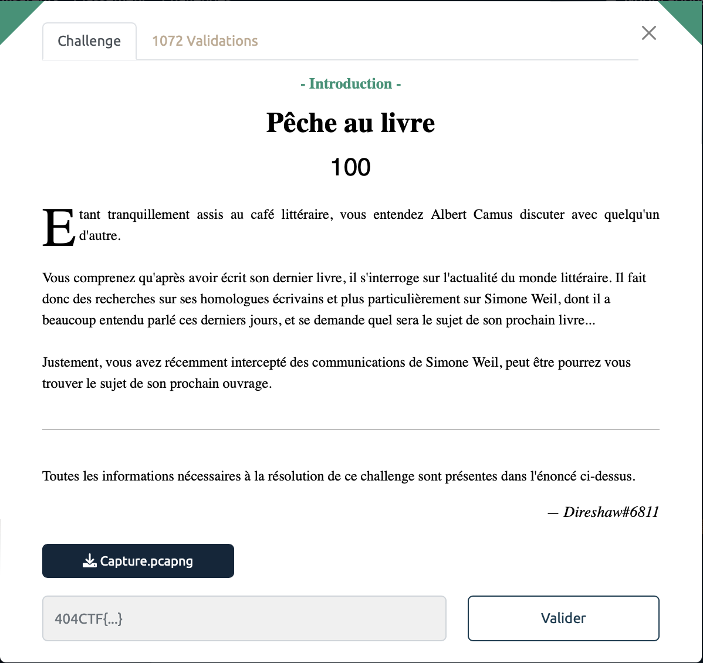
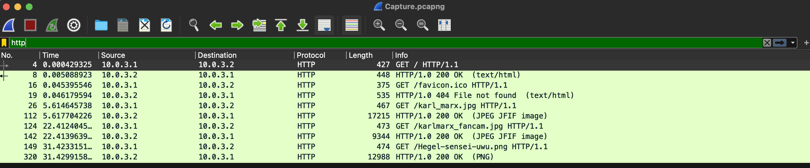

# Pêche au livre - Introduction, 100 points

Nous avons à notre disposition la capture d'une trame réseau [Capture.pcapng](./Capture.pcapng).

Nous l'ouvrons avec `Wireshark` et on filtre pour voir uniquement les requêtes HTTP. 

On découvre ainsi que trois fichiers on été téléchargés. (Requêtes du type "GET /karl_marx.jpg HTTP/1.1")

On peut alors exporter ces fameux fichier avec File > Export Objects > HTTP. 
On obtient alors plsuieurs images dont celle contenant notre précieux sésame.

Voir le flag :

***FLAG: 404CTF{345Y_W1r35h4rK}***

