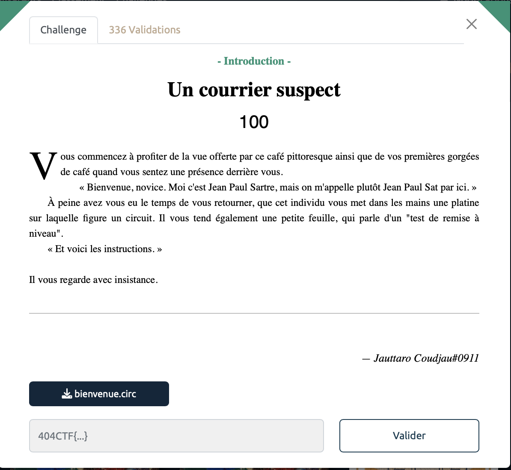
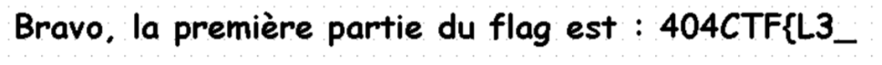
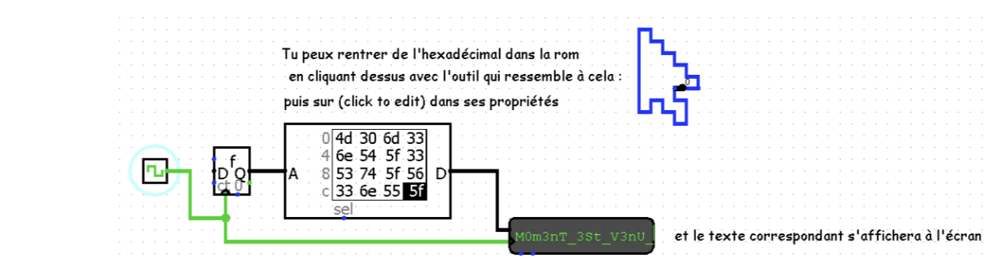
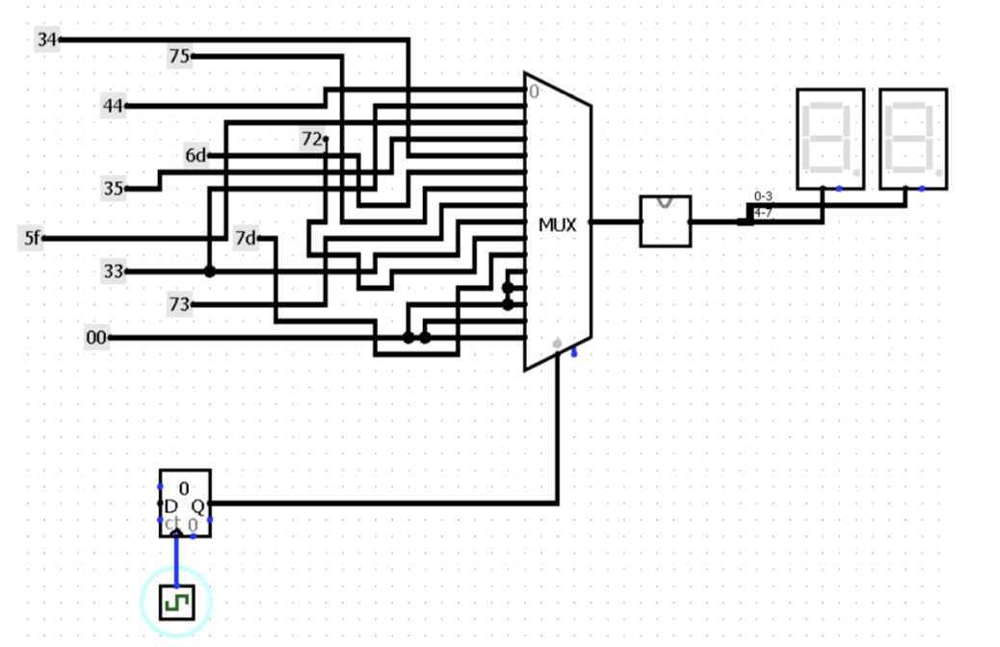

# Un courrier suspect - Intro, 100 points

Pour ce challenge, nous allons utiliser le logiciel `Logisim`, téléchargeable [ici](https://github.com/logisim-evolution/logisim-evolution). 

On ouvre alors le fichier [bienvenue.circ](bienvenue.circ).

Il ne reste alors plus qu'à suivre les indications dans les différents fichier, tout est bien indiqué, il suffit de se laisser guider pour obtenir le flag. 

La première partie du flag est indiquée en commentaire directement dans un circuit:

La deuxième partie du flag se trouve en remplissant la bonne séquence en hexa.

Enfin, en activant la clock dans simulation et en notant les outputs,

on obtient la séquence en hexa suivante:
> 44 33 5F 35 34 6D 75 73 33 72 7D

Reste plus qu'à utiliser notre ami [Cyberchef](https://gchq.github.io/CyberChef/) pour obtenir la dernière partie du flag : `D3_54mus3r}`

Voir le flag :

***FLAG: 404CTF{L3_M0m3nT_3St_V3nU_D3_54mus3r}***

