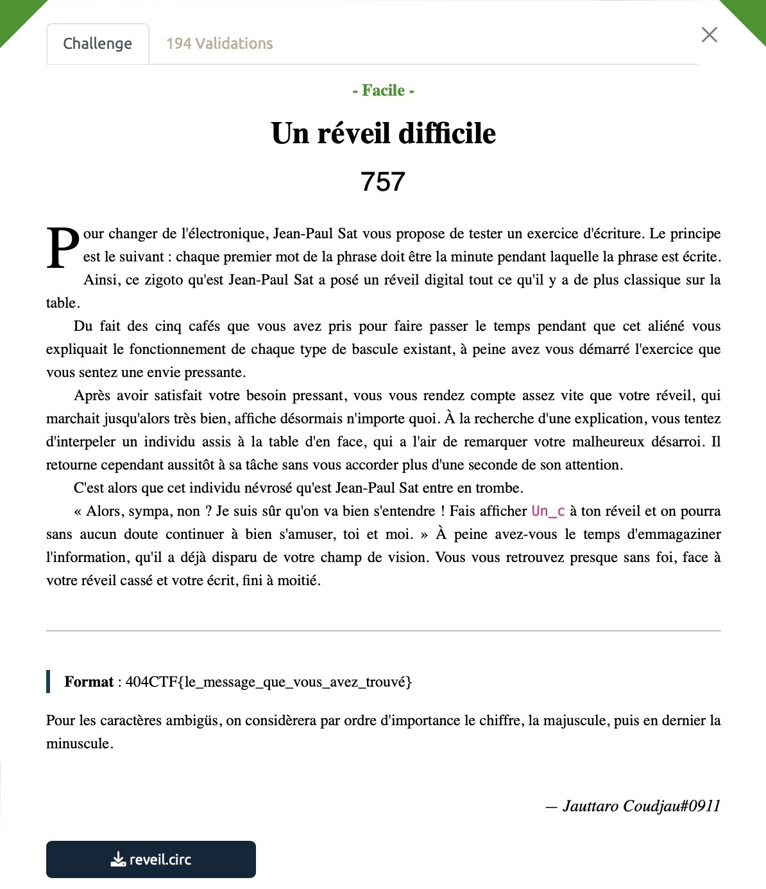

# Un réveil difficile - Facile, 757 points

Pour ce challenge, nous allons de nouveau utiliser le logiciel `Logisim`, téléchargeable [ici](https://github.com/logisim-evolution/logisim-evolution). 

On ouvre le fichier [reveil.circ](./reveil.circ) et c'est alors assez facile, il suffit de bien suivre l'énoncé.

Tout d'abord, il est dit qu'il faut afficher "Un_c". Pour ce faire, nous allons jouer avec le bloc input de gauche jusqu'à obtenir l'affichage souhaité dans les 7-seg displays. 

Il ne reste ensuite plus qu'à faire tourner la clock pour obtenir le reste du flag. Rien de bien sorcier.

Le vrai challenge est en fait de décrypter les caractères affichés. Pour éviter les galères, on s'en réfère à l'énoncé:
 "Pour les caractères ambigüs, on considèrera par ordre d'importance le chiffre, la majuscule, puis en dernier la minuscule."

Après un peu de déchiffrage on obtient notre précieux.

Voir le flag :

***FLAG: 404CTF{Un_cH1FFrA9e_A55e2_bi3n_d3PreCie}***

