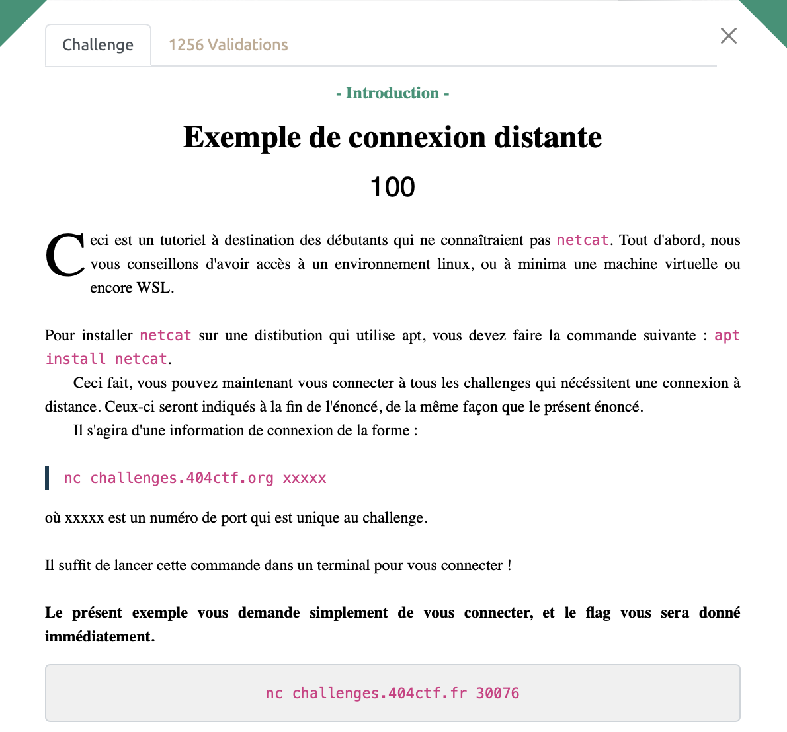

# Exemple de connexion distante - Intro, 100 points



Rien de bien sorcier ici, on ouvre un terminal et on tape
```sh
nc challenges.404ctf.fr 30076
````

On obtient alors notre bonheur.


<details>
<summary>Voir le flag :</summary>

***FLAG: 404CTF{I_<3_nc}***
</details>