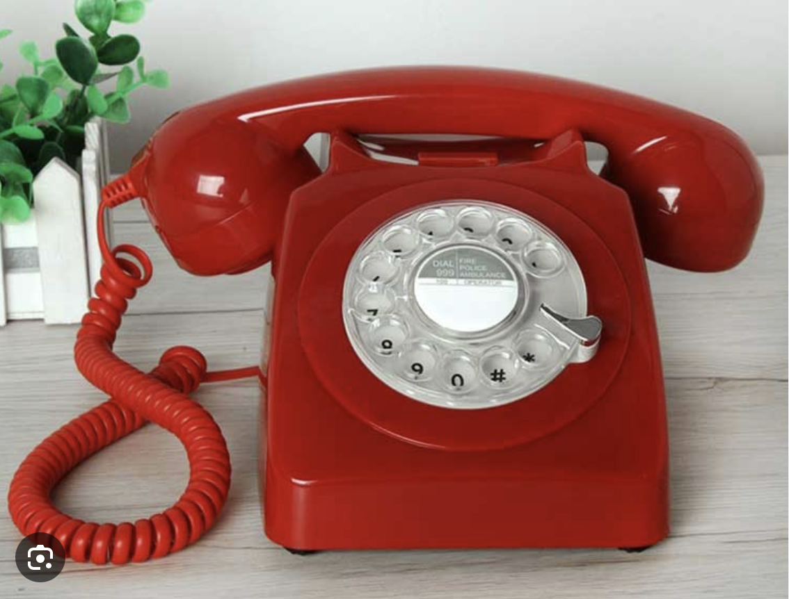

# Désirée Dubois - Facile, 958 points

fichier : [Désirée_Dubois.mp3](./Desiree_Dubois.mp3)

On assiste ici à une véritable masterclass, sans doute tournée à une heure avancée de la nuit après avoir consommé quelques substances douteuses. Vous aurez bien entendu reconnu la référence à [la mythique scène du diner de cons](https://www.youtube.com/watch?v=n5_ruQ8okms). 

Bon on s'est bien amusé à écouter cela mais il nous manque toujours notre flag, où peut-il bien se cacher.

Il y'a quelque chose d'intriguant dans cette scène, on entend très distinctement le bruit du cadran rotatif au moment de composer le numéro de téléphone de Désirée Dubois. 

Un peu archaïque comme moyen de communication mais ça fait bien notre affaire cette histoire, car en analysant la signal audio on va pouvoir retrouver les numéros tapés. 

Étant un chouïa jeune pour connaître précisement le fonctionnement de ce genre d'appareil, un tour sur [Wikipédia](https://fr.wikipedia.org/wiki/Cadran_téléphonique) s'impose. 

On met son doigt sur un des chiffres et on tourne jusqu’à la butée. Puis on relâche. Un ressort va alors faire revenir le cadran dans sa position initiale, et emettre régulièrement des impulsions électriques dont le nombre permet d’identifier le numéro choisi. 
Ainsi, en mesurant la durée prise par le cadran pour revenir à sa position initiale on devrait être en mesure de retrouver le numéro saisit. 

Il est maintenant temps de se plonger dans Audacity pour voir ce que ca donne concrètement.

On identifie assez clairement les 10 numéros, ce qui correspond bien au format des téléphones français, nous voilà rassurés on est sans doute sur la bonne piste. 

On peut alors émettre l'hypothèse (hautement probable) que le premier numéro est un 0. On suppose également un modèlelinéaire, c’est à dire que le temps pris par le cadran pour revenir au point de départ est proportionel à sa distance à l'origine. 

Avec un peu d'arithmétique élémentaire et armé d'une règle et de patience on peut alors commencer à décchiffrer notre séquence. 

Je vous épargne les fastidieux calculs et les appels inopportuns. (en masqué bien entendu, on est pas fou)

À force de persévérance, on finit par faire mouche : `04 58 10 52 54`.

En appelant ce numéro on tombe sur un charmant monsieur, qui nous [répond bien cordialement](./repondeur.mp3). 

Il ne nous reste plus qu'à rentrer le flag selon les consignes indiquées au téléphone.

Voir le flag :

***FLAG: 404CTF{justeleflag}***

***

Merci pour ce challenge pas très compliqué techniquement mais fun et original !