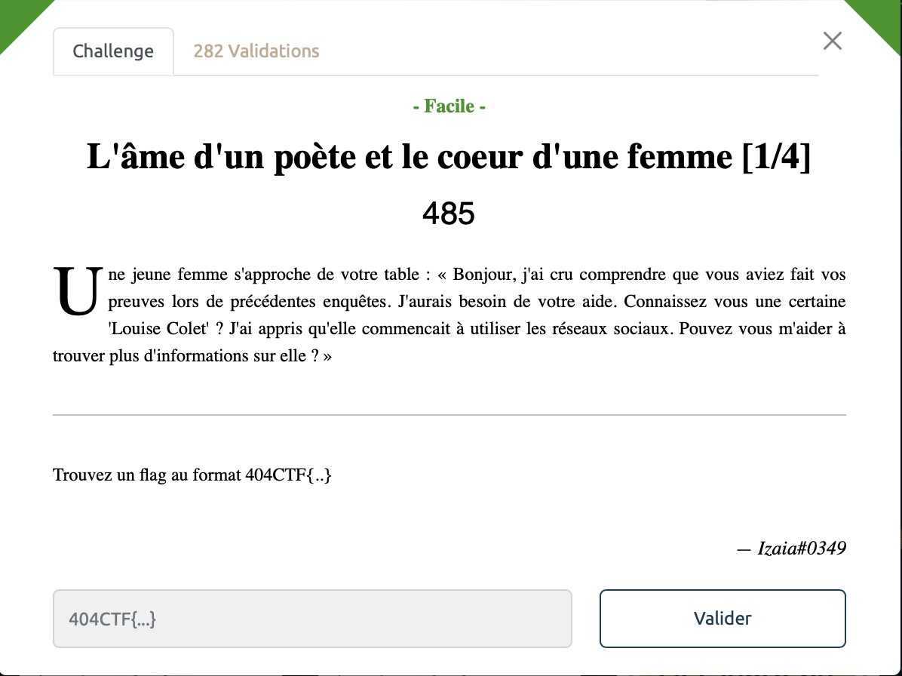
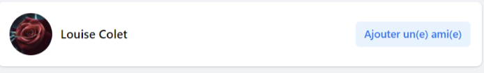
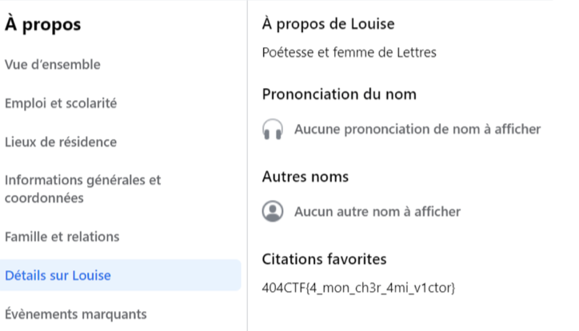

# L'âme d'un poète et le coeur d'une femme [1/3] - Facile, 485 points

***

On va chercher les profils de `Louise Colet` sur les réseaus sociaux. Pas besoin d'aller chercher bien loin, on trouve très vite son compte Facebook. Les informations sur le compte semble bien matcher avec la thématique du challenge. 

On se promène un peu sur sa page, et on tombe rapidement sur ce que l'on cherchait dans la section "à propos":  

Voir le flag :

***FLAG: 404CTF{4_mon_ch3r_4mi_v1ctor}***

On peut passer à la partie [suivante](../ame_poete_coeur_dune_femme_2/). 