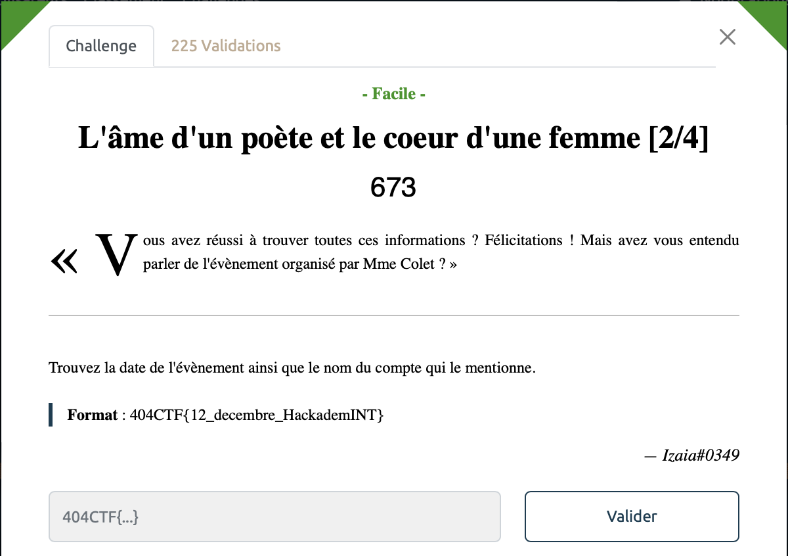
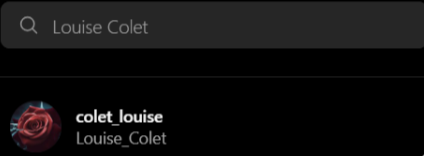
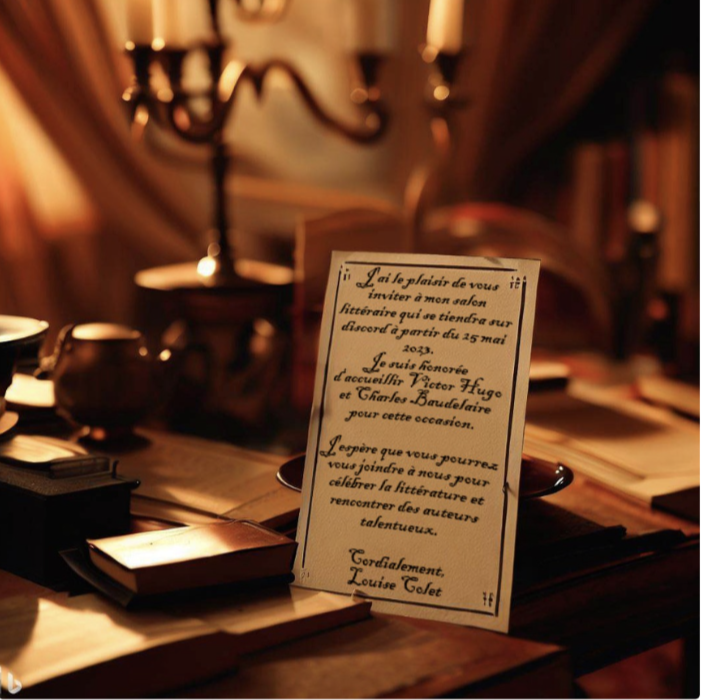

# L'âme d'un poète et le coeur d'une femme [2/4] - Facile, 673 points

De nouveau, pas besoin d'aller chercher bien loin, on trouve très vite son compte Instagram, qui utilise la même photo de profil que son compte Facebook et qui a également été créé récemment. 

On trouve alors la première publication sur le compte qui fait mention de la tenue d'un salon littéraire sur Discord. Ca tombe à pic, c'est ce que l'on recherchait !

Voir le flag :

***FLAG: 404CTF{25_mai_colet_louise}***  

On peut passer à la partie [suivante](../ame_poete_coeur_dune_femme_3/). 