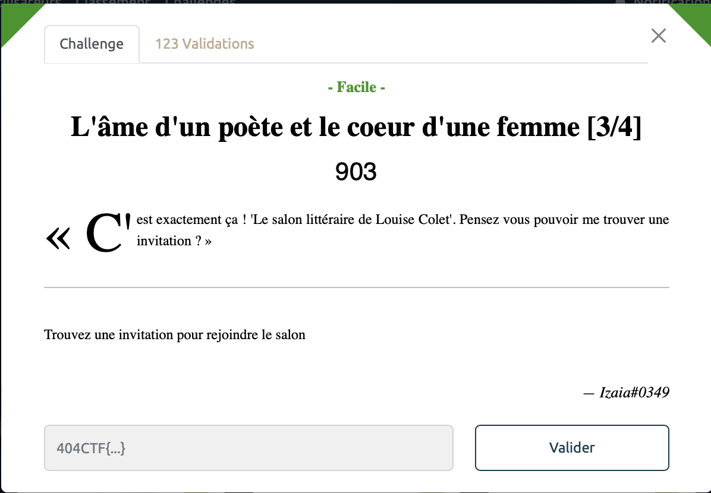
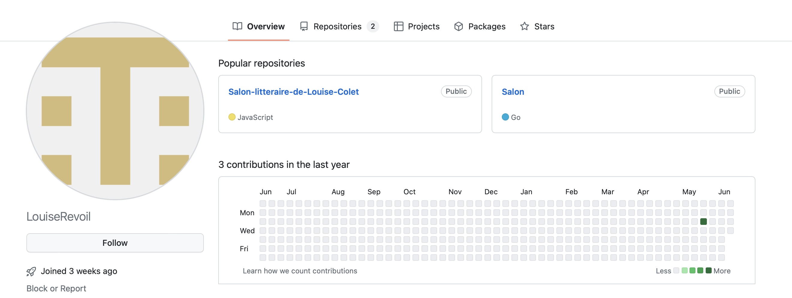

# L'âme d'un poète et le coeur d'une femme [3/4] - Facile, 903 points

Les choses commencent à se corser, il s'agit maintenant de trouver une invitation à ce fameux salon discord. On a beau chercher partout sur les réseaux sociaux, faire des recherches google advanced dans tous les sens, utiliser des outils d'OSINT, faire de la stegano dans tous les sens, on ne trouve rien. 

On se pose alors un peu et on se rend compte que les serveurs Discord on souvent des bots pour gérer les membres et l'administration d'un forum. Et en général ces bots sont retrouvables sur discord. 

Et en effet, en cherchant le fameux Salon Littéraire de Louise Colet sur Github, on tombe rapidement sur ce [repo](https://github.com/LouiseRevoil/Salon-litteraire-de-Louise-Colet). 

Et en fouillant un peu dans le `README.md` on tombe tout de suite sur le [lien d'invitation Discord](https://discord.gg/NeCgh9ZZqD) et le flag de cette 3e partie.

Voir le flag :

***FLAG: 404CTF{B13nv3nue_d4ns_le_s4lon_l1tter4ir3_de_lou1se_C0l3t}***  

On peut enfin passer à la [dernière partie](../ame_poete_coeur_dune_femme_4/). 