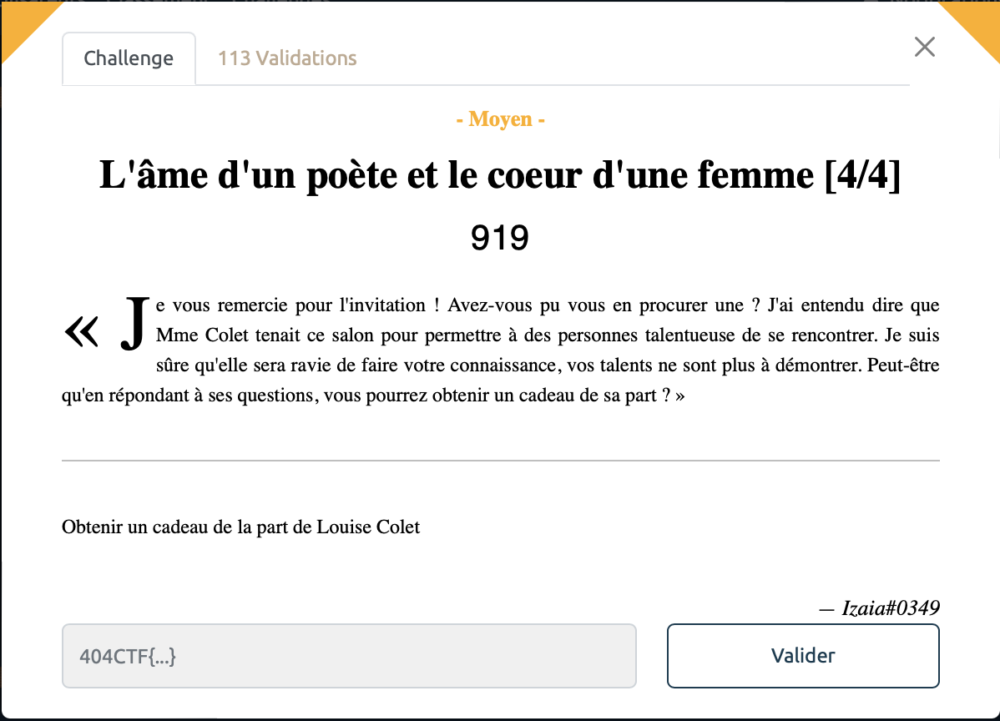
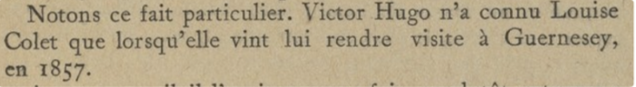

# L'âme d'un poète et le coeur d'une femme [4/4] - Moyen, 919 points

Ainsi, on arrive sur ce fameux forum. Il va falloir répondre à un ensemble de question pour espérer rejoindre notre chère et tendre Louise Colet. 

Pour commencer, il faut taper `le_petit_salon` pour obtenir l'accès à un nouveau salon.

Se présente alors une nouvelle énigme:
> Bonjour , savez vous en quelle année un promeneur inoccupé qui, sortant du jardin des Tuileries, se serait dirigé sous les arcades de la rue de Rivoli, aurait pu apercevoir sous la porte cochère d'un des plus beaux hôtels du quartier, un grand vieillard à la chevelure et à la moustache blanches ?

Connaissant par coeur l'oeuvre de Louise Colet, on trouve facilement la réponse dans "Un drame dans la rue de Rivoli". C'était en `1885` bien entendu. (Pour les plus incultes, une rapide recherche Google faisait également l'affaire). 

On se retrouve maintenant dans le boudoire où un nouveau problème se présente:
> Complétez la suite du poème :
> Laisse à l'homme la gloire,
> Les triomphes, le bruit,

>Format : pas de retour à la ligne, majuscule au début des vers, laisser les espaces et la ponctuation 

C'est l'heure de réciter sa poésie, une nouvelle fois, la maîtrise de la bibliographie du 19e siècle paye. Attention néanmoins à bien respecter le format imposé sous peine de mauvaise surprise. (les moins érudits pourront de nouveau se contenter d'une recherche sur le *World Wide Web* pour trouver leur bonheur). 

Il faut saisir: `Pour nous, aimer et croire Au bonheur nous conduit. Coule une vie obscure Que le devoir remplit ; L’onde à l’ombre est plus pure, Rien ne trouble son lit.`

Enfin les choses sérieuses commencent, nous arrivons dans le fumoir. 

Il faut maintenant trouver 
> Où et quand ai-je rendu visite à Mon ami Victor Hugo pour la première fois ?

Ici les choses se corsent, malgré de solides compétences historiques j'avoue ne pas être au courant des relations privées de Madame. C'est alors que que je demanda à Google de venir à la rescousse. Après de moultes tentatives en pagaille, toutes plus infructueuses les une que les autres. Je m'en remets vainement à mon cher et tendre ChatGPT. Las, j'entrepris une dernière recherche sur l'Internet, et là, bingo, je tombe sur le site de la BNF où je découvre un ouvrage écrit par *Gustave Simon* au sujet de nos deux tourtereaux. 

Après m'être délecté de cet ouvrage je pû tranquillement flagger ce chall grâce à la précieuse information discrètement cachée à la page 203:

Il suffisait donc d'envoyer `Guernesey_1857` pour enfin rejoindre la bibliothèque où le flag nous attendait sagement. 

C'était un vrai plaisir de faire la connaissance de cette charmante demoiselle. 

Voir le flag :

***FLAG: 404CTF{B13nv3nue_d4ns_le_s4lon_l1tter4ir3_de_lou1se_C0l3t}***  

