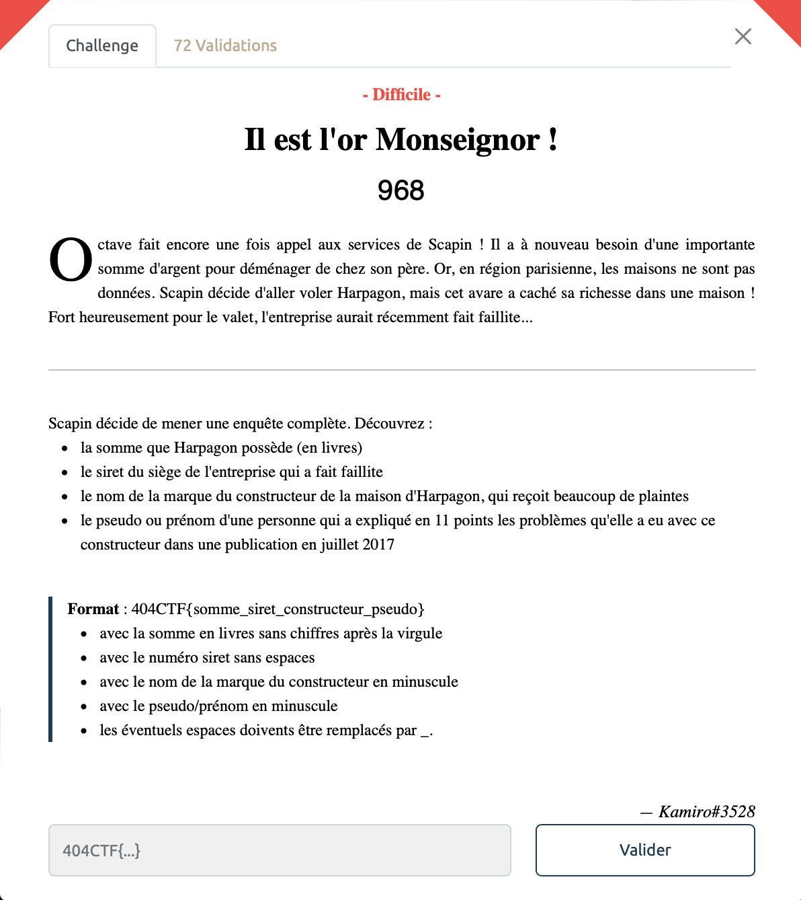
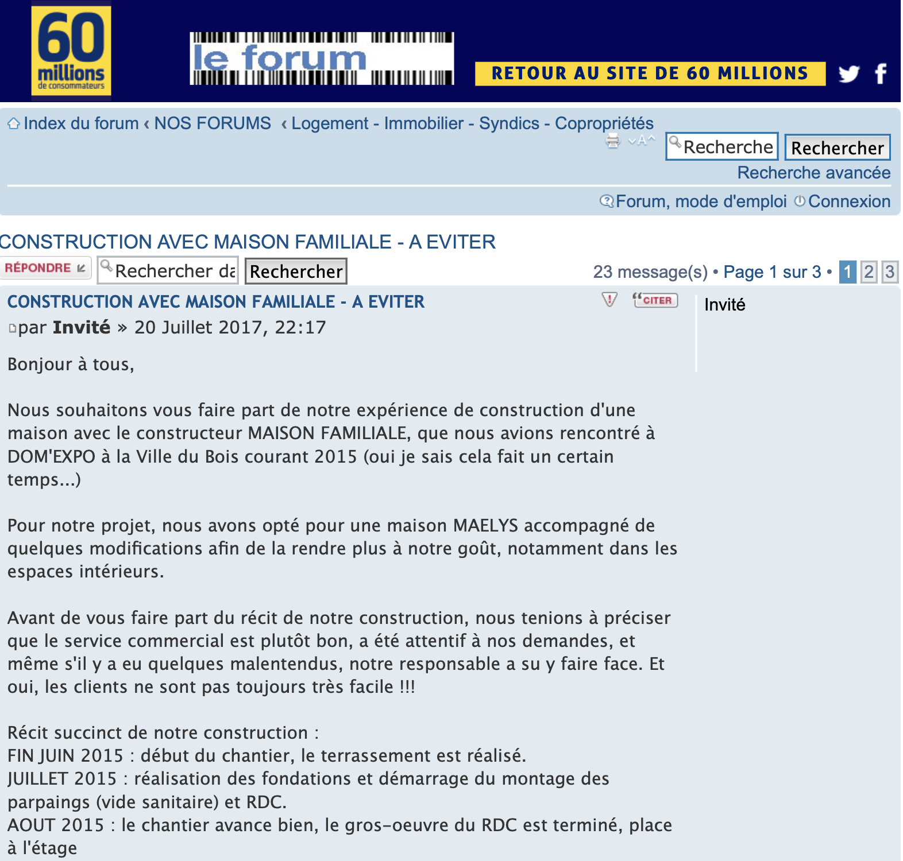
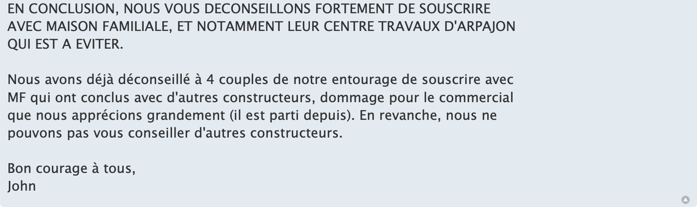
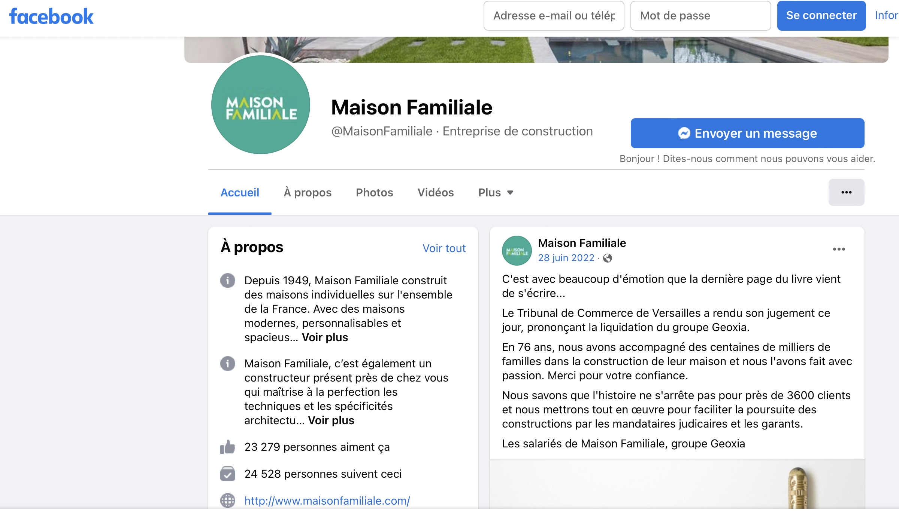

# Il est l'or Monseignor - Difficile, 968 points

En voila un paquet d'informations à retrouver.

Il va falloir (ab)user des [recherches Google Avancées](https://www.google.ca/advanced_search). 

C'est ainsi que l'on atterit sur ce forum [https://www.60millions-mag.com/forum/travaux--f78/construction-avec-maison-familiale-a-eviter-t45687.html] où un dénommé "John" donne un avis pas franchement dithyrambique en 11 points sur l'entreprise "Maison Familiale":

Ca donne pas franchement envie de se faire construire une maison chez eux cette histoire ... 

Bon ça fait déjà deux informations dont nous avions besoin:
> entreprise: maison_familiale
> pseudo forum: John

Il faut maintenant trouver le siret du siège de l'entreprise qui a fait faillite. C'est là que les galères commencent. On trouve plusieurs SIRET d'entreprises qui ont l'air de matcher ce que l'on recherche sur societe.com mais ce n'est pas si simple, rien ne semble fonctionner. 
C'est alors que l'on trouve la page Facebook de cette fameuse entreprise, faisait justement mention d'une faillite et évoquant la maison mère de l'enteprise, le groupe `Geoxia`. 

Il ne reste plus qu'à trouver le site de cette fameuse entreprise `Geoxia`. On trouve ainsi toutes les informations dont on a besoin [ici](https://www.societe.com/societe/geoxia-ile-de-france-320920911.html).

Nous avons maintenant une troisième information à notre disposition: 
> siret: 32092091100817
>

Il faut maintenant se pencher sur la somme que Harpagon possède, ça semble bien énigmatique comme information, sans lien apparent avec le reste des informations collectées. 

Heureusement, grâce à une maitrise certaine de la littérature française on pense à Harpagon, personnage phare de l'Avare de Molière (JB pour les intimes). 

On pense plus spécifiquement à son célèbre monologue dans l'acte IV, scène 7 où il évoque sa cassette qui contient `dix mille écus d'or`.

On utilise alors un [convertisseur d'anciennes devises](https://convertisseur-monnaie-ancienne.fr/?Y=1650&E=10000&L=0&S=0&D=0) pour convertir cette somme en livres. On obtient ainsi la dernière information manquante.

> somme : 300000 livres

Il ne reste plus qu'à assembler toutes ces informations ensemble pour valider le challenge.

Voir le flag :

***404CTF{30000_32092091100817_maison_familiale_john}***

