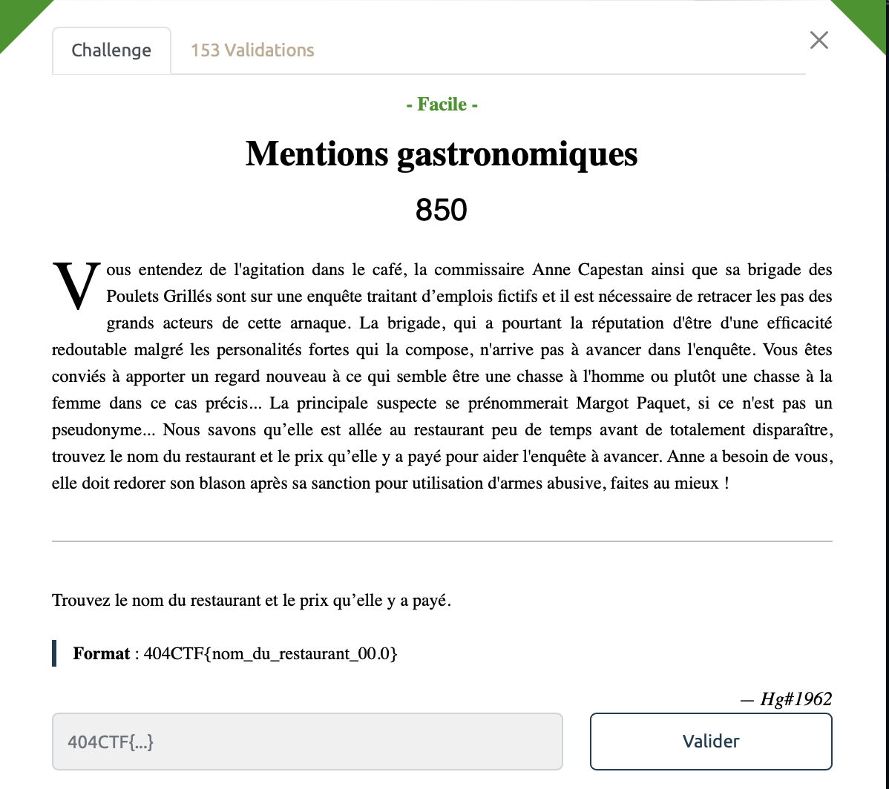
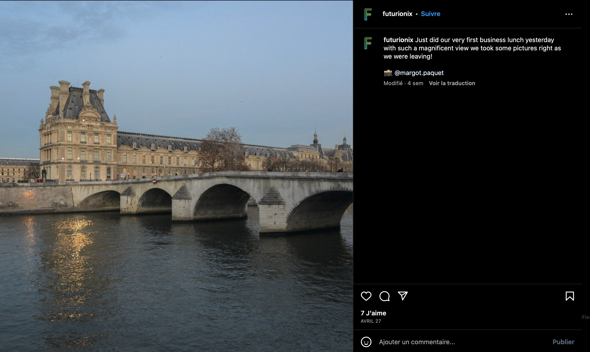

# Mentions gastronomiques - Facile, 850 points

Ah, j'en ai perdu du temps sur ce challenge... 

Très vite, on trouve le [compte instagram](https://www.instagram.com/margot.paquet/) de cette satanée Margot Paquet où elle a récemment publié un paquet de photos de nourriture. 

En regardant les légendes, on comprend vite qu'elle a pris une tarte tatin avec un boeuf bourguignon au restaurant.

Il faut maintenant trouver où est ce qu'elle est allée diner. 

En regardant les publications [où elle a été mentionnée](https://www.instagram.com/margot.paquet/tagged/), on tombe sur le [compte instagram de "Futurionix"](https://www.instagram.com/futurionix/).

On y trouve les informations suivantes:

On reconnait bien entendu le louvre et un rapide tour sur Google Maps nous permet de retrouver le nom du restaurant: La Frégate. On se plonge alors dans la carte du restaurant sur la [Fourchette](https://www.thefork.fr/restaurant/la-fregate-r2064#booking=). On essaye tout plein d'additions et de combinaisons différentes de plat, en vain, rien ne marche. 

Une information retient tout de même notre attention, sur son compte instagram, Margot fait mention du boeuf bourguignon en précisant "mon go to au restaurant quand il est à moins de 15€!". Or le boeuf bourguinon est à 16,50€ sur le site de the Fork. 

On regarde alors les photos des menus sur les avis Google qui semble varier au gré des saisons. Après moulte tentative on finit par trouver la réponse escontée, 24€, soit un boeuf bourguignon et une tarte tatin. 

Un peu déçu par ce challenge, les prix sur les menus sont trop variables et les ingrédients consommés par Margot n'était pas clair avec des photos tirées tout droit de google images. 

Voir le flag :

***404CTF{la_fregate_24.0}***

