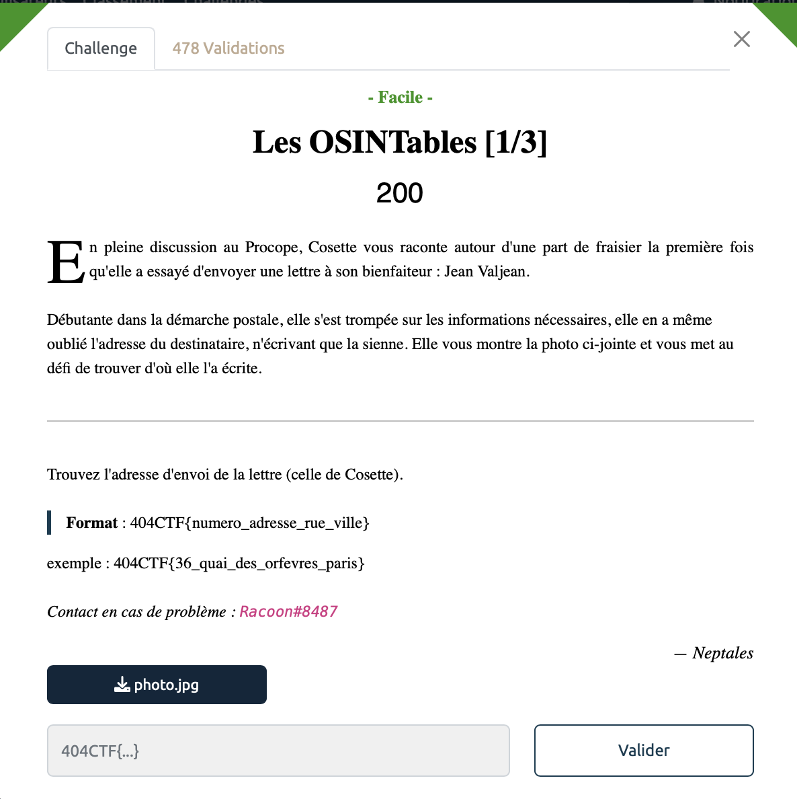
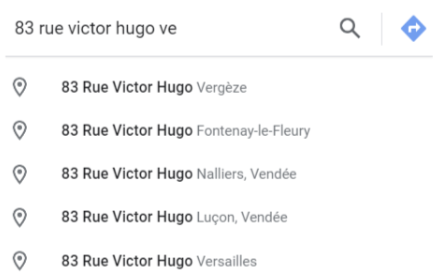

# Les OSINTables [1/3] - Facile, 200 points

Nous avons à notre disposition l'image d'une enveloppe en partie déchirée:

En regardant l'image nous obtenons les informations suivantes : 
- Le numéro : LXXXIII (83 en chiffres romains)
- Le nom de la rue : rue Victor Hugo
- Le début du nom de la ville : VE

On rentre alors les informations suivantes sur google maps qui nous suggère les informations suivantes:

On en déduit que l'addresse recherchée est soit à Vergèze, soit à Versailles. Il ne reste plus qu'à essayer les deux pour trouver le flag.

Voir le flag :

***FLAG: 404CTF{83_rue_victor_hugo_vergeze}***  

***

On peut passer à la [suite](../osintables_2/). 