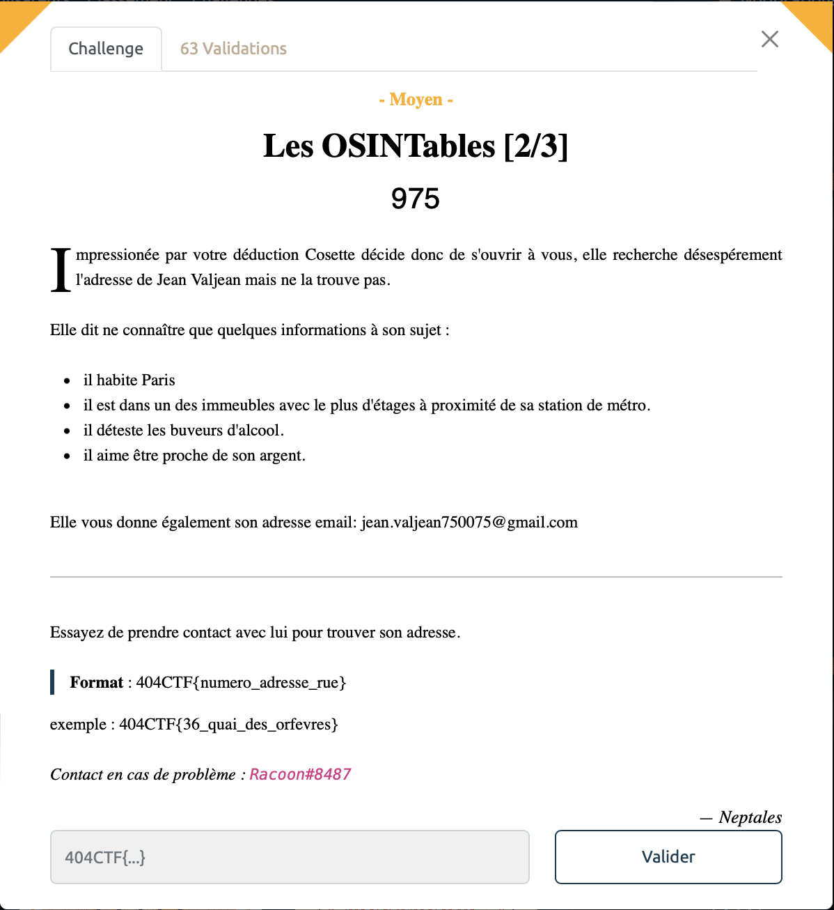
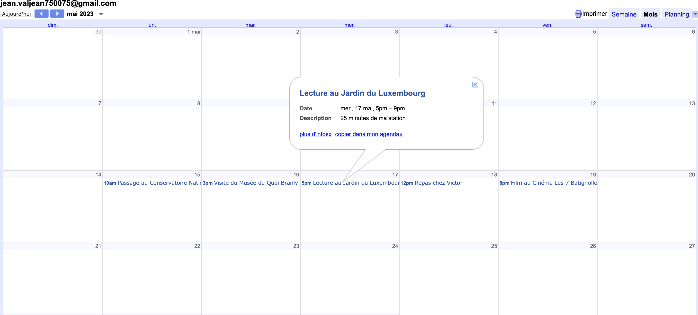
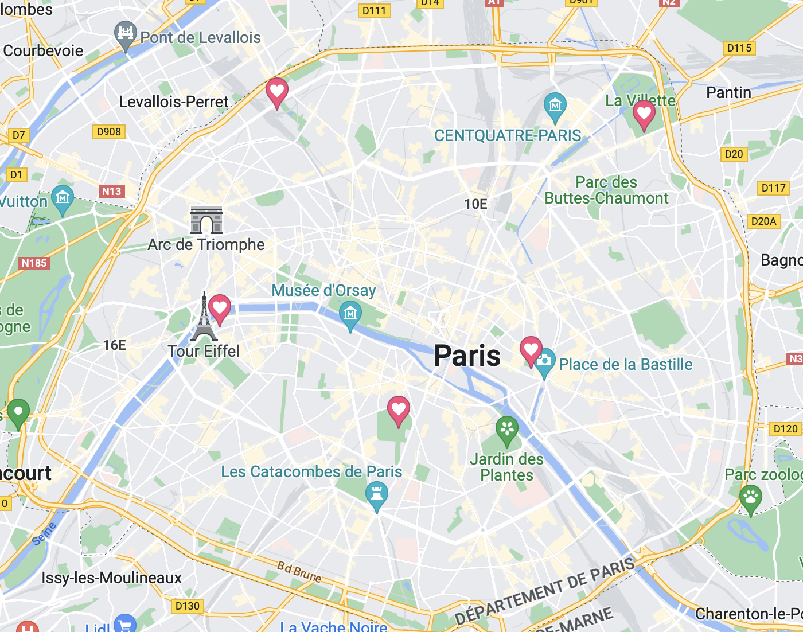

# Les OSINTables [2/3] - Moyen, 975 points

Les choses sérieuses commencent.

On utilise l'outil [epieos](https://epieos.com) pour trouver des informations sur l'addresse mail `jean.valjean750075@gmail.com`.

C'est ainsi que l'on trouve qu'il à un calendrier google public que l'on peut consulter:

En regardant le mois de mai, on découvre son programme de la semaine à Paris, avec des positions destinations et des durées de trajet depuis chez lui. On utilise alors Google maps pour pinpoint les différents endroits où il s'est rendu, on observe qu'ils forment un cercle , sans doute autour de son adresse.

En regardant plsu spécifiquement les stations de métro et en gardant uniquement celles ayant des durées cohérentes par rapport aux destinations indiquées. Trois stations retiennent mon attention; celle de Place de Clichy, celle de Blanche et celle de Pigalle. 

On sait également qu'il aime être proche de son argent, on en déduit qu'il y'a une banque proche de chez lui. Or il n'y a pas de banque autour de l'arrêt Blanche que l'on peut donc éliminer.

On sait aussi, qu'il est dans un des immeubles avec le plus d'étages aux alentours de la station de métro. On va alors explorer les environs dans Google Street View, d'abord porte de clichy mais il n'y a aucun immeuble qui soit franchement plus haut que les autres, bref rien de probant. On va alors à Pigalle et là, juste au dessus de la banque LCL, on voit un bâtiment plus haut que les autres, il est également pas juste à côté d'un bar ce qui est cohérent car JVJ déteste les buveurs d'alcool. 

On essaye donc l'adresse du LCL place Pigalle et BINGO, first shot, on a retrouvé Jean !

Voir le flag :

***FLAG: 404CTF{7_place_pigalle}***  

