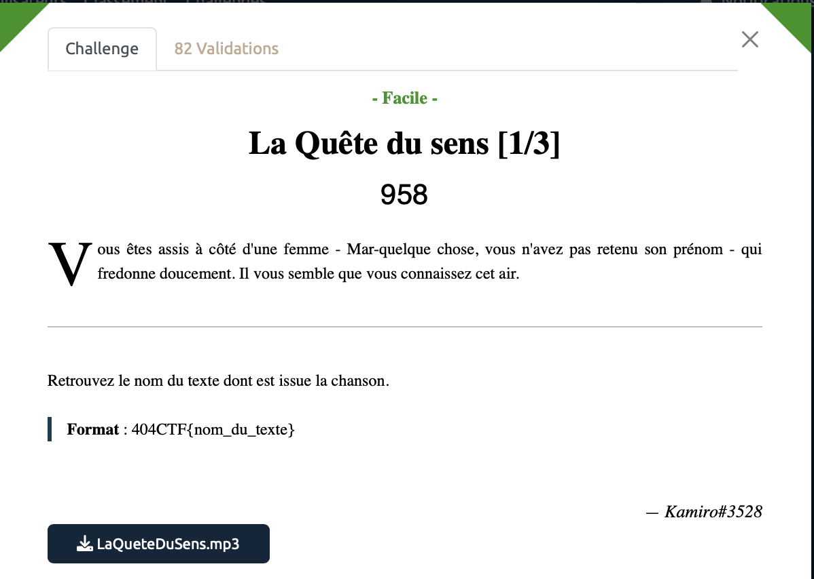

# La quête du sens [1/3] - Facile, 958 points

On a seulement à notre disposition un fichier MP3 où on entend des instruments joué pendant 17 secondes. On doit alors retrouver le nom du texte dont est issu la chanson.

Et là on se dit facile, petit coup de Shazam et c'est bouclé. Eh ben non, le nombre de validations ne serait pas si faible si c'était si simple d'ailleurs.

Challenge un peu hasardeux, j'ai testé des paquets de fois des tonnes de logiciels de reconnaissance musicale (Shazam, Google Assistant, SoundHound et d'autres obscurs outils en ligne).

Pour finir par faire mouche et découvrir que le morceau recherché est la chanson "Les séparés" de Julien Clec. 

À noter qu'il aurait sans doute était malin de procéder différement en partant des informations présentes dans l'énoncé, notamment le fait que le nom de l'autrice commence par "Mar". 

Voir le flag :

***FLAG: 404CTF{les_separes}***

On attaque la [suite](../quete_du_sens_2/). 