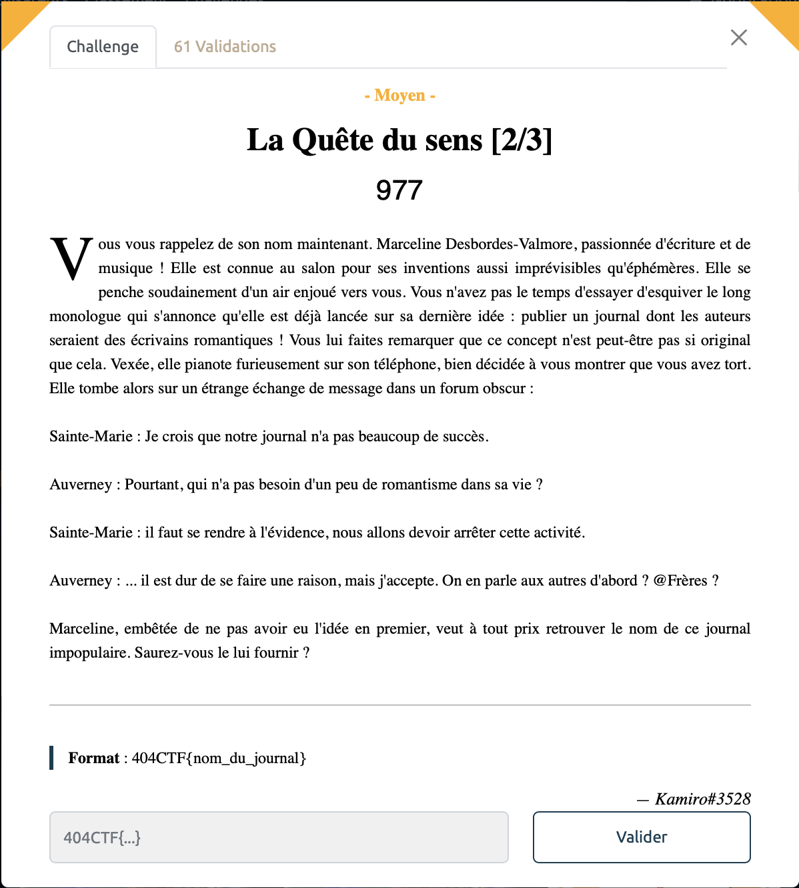

# La quête du sens [2/3] - Moyen, 977 points

En cherchant sur Internet les noms Sainte-Marie et Auverney on tombe sur la page wikipédia du roman [Bug-Jargal](https://fr.wikipedia.org/wiki/Bug-Jargal) de Victor Hugo. 
Il y est fait mention du journal "le conservateur littéraire" qui a en effet pas existé longtemps comme mentionné dans l'énoncé.

Voir le flag :

***FLAG: 404CTF{le_conservateur_litteraire}***

On attaque la [fin](../quete_du_sens_3/). 