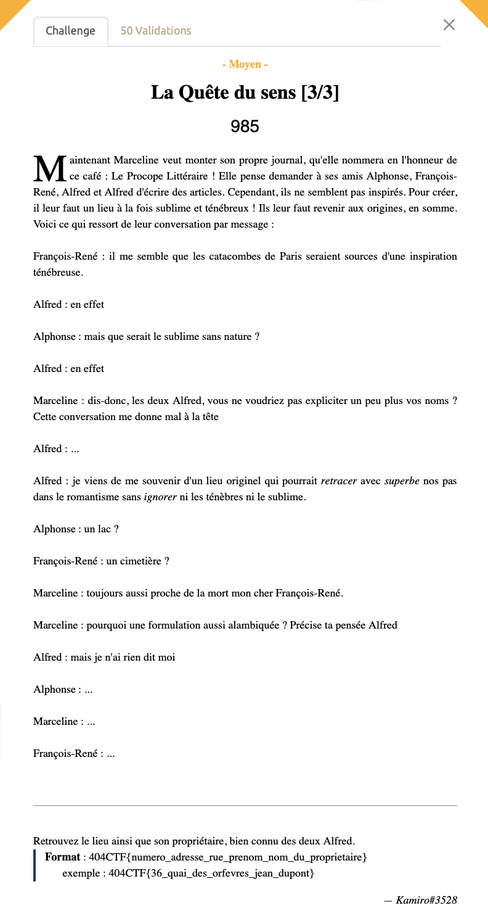

# La quête du sens [3/3] - Moyen, 985 points

On découvre assez rapidement avec des recherches Google Advanced que l'on s'intéresse à Alfred de Musset et Alfred de Vigny. 
On s'intéresse alors à la Bibliothèque de l'arsenal (BNF) qui était fréquenté par nos auteurs. 

On en apprend un peu plus [ici](http://www.parisrevolutionnaire.com/spip.php?article2485) sur Charles Nodier: "conservateur de la bibliothèque de l’Arsenal, réunit chez lui les auteurs romantiques".

On y découvre également que ses appartements de fonction se trouve au 3 rue de Sully. 

Apparemment il existait une méthode plus simple en utilisant le site [what3words](https://what3words.com/fr/about) à partir des 3 mots en italique présents dans le texte (retracer, superbe et ignorer). On peut ainsi obtenir directement la position recherchée. 

Voir le flag :

***FLAG: 404CTF{3_rue_de_sully_charles_nodier}***

