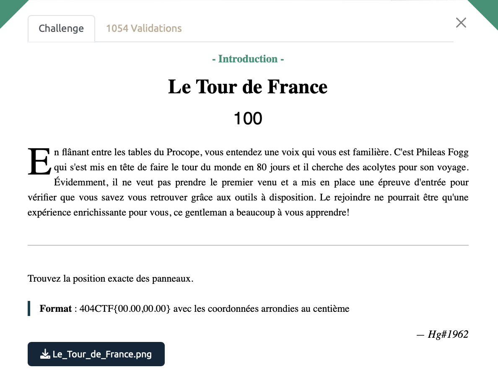

# Le Tour de France - Intro, 100 points

On a une image prise sur l'autoroute à notre disposition et c'est parti pour une petite partie de GeoGuesser.

On note la mention du quartier de Beaune (Saint Nicolas), nous sommes donc sur l'A6, proche de la sortie pour la ville de Beaune. 

Dès que l'on a trouvé une position qui semble cohérente avec les indications trouvées sur le paneau et on passe en google streetview. On tombe assez rapidement exactement à l'endroit où a été prise la photo. 

Il ne reste plus qu'a récupérer la longitude et la lattitude correspondante (on les trouve dans l'URL).
On pense à bien arrondir les coordonnées au centième et on obtient les valeurs suivantes : `47.02 et 4.87`.

Voir le flag :

***FLAG: 404CTF{47.02,04.87}***

