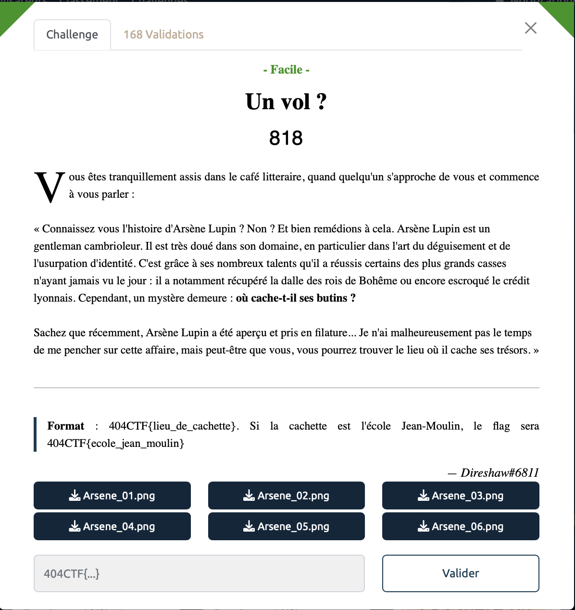
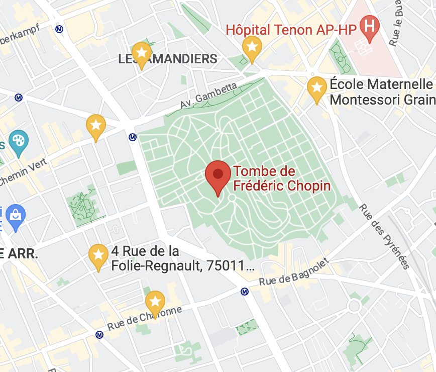

# Un vol - Facile, 818 points

***

On a 6 images prise lors de la filature de Lupin à notre disposition. On peut alors utiliser nos skills de petits espions apprentis pour retrouver les positions exactes où ces photos ont été prises sur Google Maps. 

<table>
  <tbody>
    <tr>
      <td></td>
      <td></td>
    </tr>
        <tr>
      <td></td>
      <td></td>
    </tr>
    </tr>
        <tr>
      <td></td>
      <td></td>
    </tr>
  </tbody>
</table>

On obtient les points suivants (en jaune avec des étoiles) sur Google Maps. On remarque que les points forment quasiment un cercle avec, a peu près au centre la Tombe de Chopin qui est le lieu de cachette du butin. 

