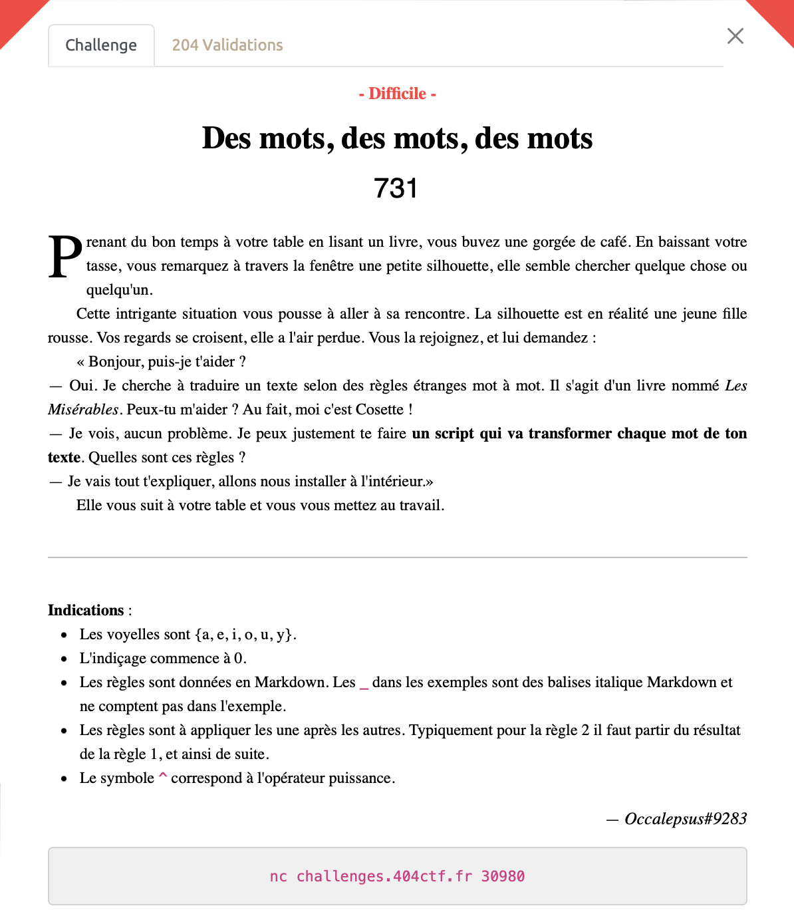
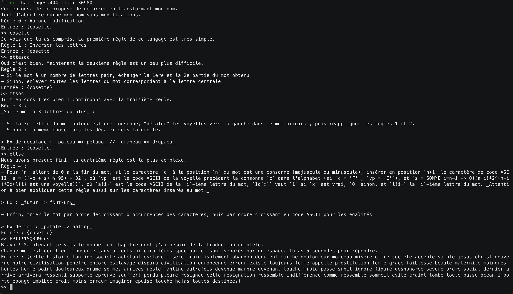

# Des mots, des mots, des mots - Difficile, 731 points

Il s'agit ici d'écrire un script pour implémenter des règles toutes plus farfelues et mal expliquées les unes que les autres à un texte.

Le problème: les explications sont vraiment pas claires et m'ont fait perdre beaucoup de temps et il a fallut harceler les admins plus d'une fois. 

Après pas mal de sueur (et de Copilot, on va pas se le cacher), on obtient ce [torchon](./des_mots_et_des_mots.py) et notre flag.

Voir le flag :

***FLAG: 404CTF{:T]cdeikm_)W_doprsu_nt_;adei}***

