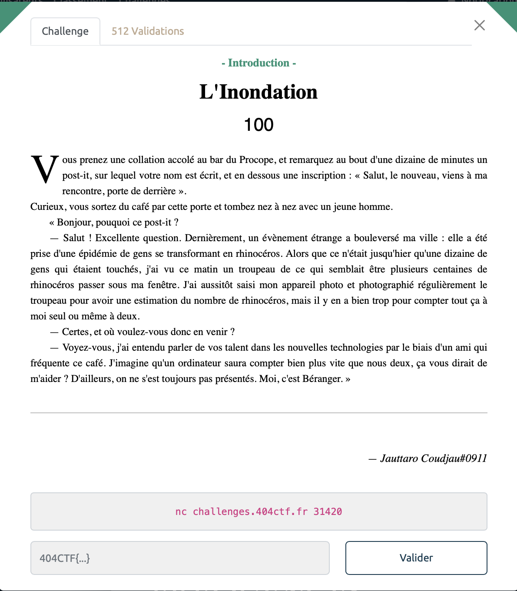
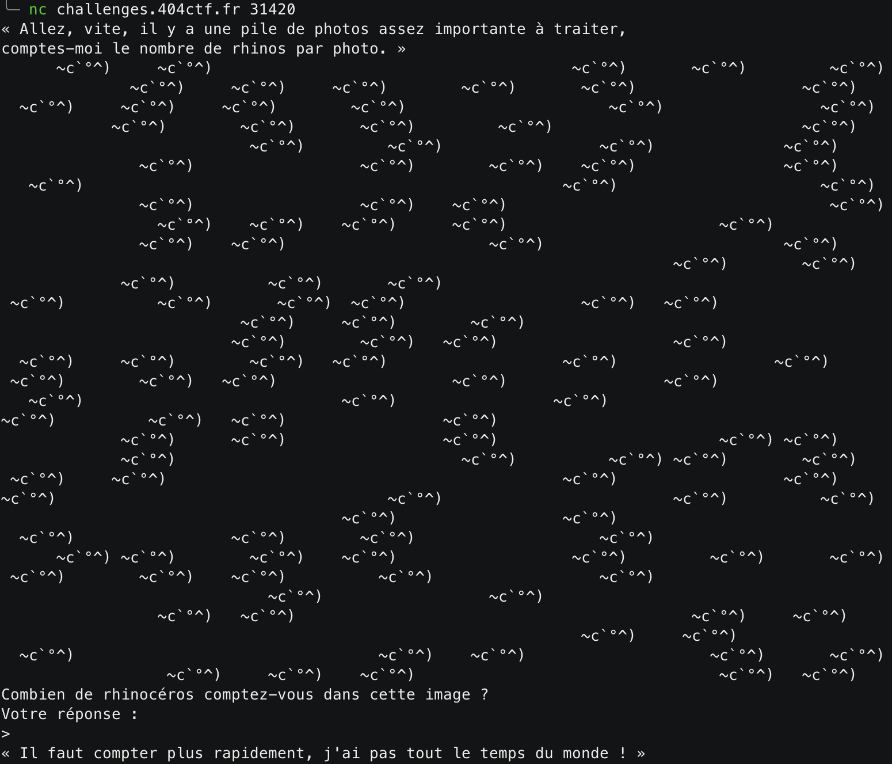

# L'Inondation - Intro, 100 points



*** 

Pour ce challenge, nous allons compter des rhinos et envoyer notre réponse à un serveur netcat. Le problème c'est qu'il y'a un paquet de rhino et le bot va nous poser la question plusieurs fois. On va donc devoir automatiser tout ça. Rien de bien sorcier néanmoins grâce à la merveille qu'est `pwntools`.





Vous voyez ca fait un paquet de rhinos et en plus on a à peine 5 secondes pour tout compter.

Grâce à ce petit script on arrive néanmoins à faire ça tout ça en un rien de temps et on obtient alors notre cher et tendre sésame : 

```python
import pwn

host = "challenges.404ctf.fr"
port = 31420

def count_occurence(data):
    count = 0
    for i in data:
        if i == 0x7e:
            count += 1
    return count

# open connection and receive input using pwn
conn = pwn.remote(host, port)
data = conn.recvline()
print(data)
data = conn.recvline()
print(data)

# count total number of occurence
total = 0
while True:
    data = conn.recvline()
    print(data)
    total += count_occurence(data)
    print(total)

    if "Votre" in str(data):
        conn.sendline(str(total))
        print("sending total")
        total = 0

conn.interactive()
```


<details>
<summary>Voir le flag :</summary>

***FLAG: 404CTF{4h_l3s_P0uvo1rs_d3_l'iNforM4tiqu3!}***
</details>