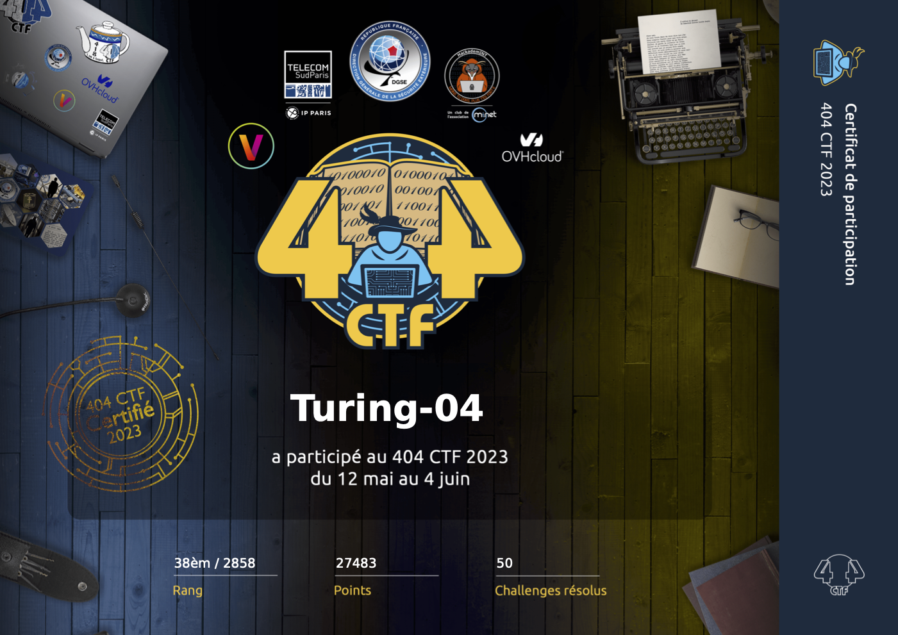

  
  <h1 style=>404 CTF 2023 - Writeups</h1>
  

  

## Le 404 CTF

Le 404 CTF est la plus grande compétition de cybersécurité française. Elle est coorganisée par [la DGSE](https://www.dgse.gouv.fr), [Télécom SudParis](https://www.telecom-sudparis.eu), [HackademINT](https://www.hackademint.org), [OVHcloud](https://www.ovhcloud.com) et [Viva Technology](https://vivatechnology.com). L'édition 2023 s'est tenue du 12 main au 4 juin 2023 et a rassemblé près de 3000 participants autours de la centaine de challenges conçus par HackademINT.

## Résultat

J'ai manqué de temps pendant ce CTF et j'ai concentré la plupart de mes efforts sur les tous premiers et les tous derniers jours. J'ai découvert le 404CTF l'année dernière qui m'a beaucoup plu et c'était donc un plaisir d'y participer de nouveau cette année. J'ai terminé **38e** au classement général. Le classement complet est disponible [ici](https://www.404ctf.fr/ranking.html). 

  

# Challenges résolus
Les challenges avec une ⭐️ sont ceux que j'ai le plus apprécié. 

##  🔎 [Analyse forensique](Forensics) - *Forensic analysis*

- [X] [Intro - pêche au livre](./Forensics/peche_au_livre/) [100 points]
- [X] [Le mystère du roman d'amour](./Forensics/le_mystere_du_roman_d_amour/) [200 points]
- [X] [Les mystères du cluster de la comtesse de Ségur](./Forensics/les_mysteres_du_cluster_de_la_comtesse_de_segur/) [385 points]
- [X] [Lettres volatiles](./Forensics/lettres_volatiles/) [757 points]
- [X] [Note de bas de page](./Forensics/note_de_bas_de_page/) [954 points]
  

## 🔐 [Cryptanalyse](Crypto) - *Cryptanalysis*
- [X] [Intro - recette](./Crypto/recette/) [100 points]
- [X] [Dessine-moi une courbe elliptique](./Crypto/courbe_elliptique/) [812 points]

 
## ☎️ [Divers](Misc) - *Miscellaneous*
- [X] [Intro - Bienvenue ](./Misc/bienvenue/) [100 points]
- [X] [Intro - Example de connexion distante ](./Misc/connexion_distante/) [100 points]
- [X] [Intro - Discord ](./Misc/discord/) [100 points]
- [X] [Intro - À vos plumes ](./Misc/a_vos_plumes/) [10 points]
- [X] [Désirée Dubois ](./Misc/desiree_dubois/) [958 points]

## 🖥️ [Programmation](Prog) - *Programming*
- [X] [Intro - Inondation ](./Prog/inondation/) [100 points]
- [X] [Des mots, des mots, des mots ](./Prog/des_mots/) [731 points]

## 📡 [Radio-Fréquences](RadioFrequencies) - *Radio Frequencies*
- [X] [Intro - NAVI ](./RadioFrequencies/navi/) [100 points]
- [X] [Avez-vous vu la cascade des hérissons ](./RadioFrequencies/herissons/) [872 points]
- [X] [Le plombier du Câble](./RadioFrequencies/plombier/) [992 points] ⭐️
- [X] [Ballistic missile submarine](./RadioFrequencies/ballistic_missile_submarines/) [972 points]

## 🌎 [Renseignement en sources ouvertes](OSINT) - *Open Source Intelligence* (OSINT)
- [X] [Intro - Le Tour de France ](./OSINT/tour_de_france/) [100 points]
- [X] [Mentions gastronomiques ](./OSINT/mention_gastronomique/) [850 points]
- [X] [Un vol ?](./OSINT/un_vol/) [818 points]
- [X] [La Quête du sens [1/3]](./OSINT/quete_du_sens_1/) [958 points]
- [X] [La Quête du sens [2/3]](./OSINT/quete_du_sens_2/) [977 points]
- [X] [La Quête du sens [3/3]](./OSINT/quete_du_sens_3/) [985 points]
- [X] [Les OSINTables [1/3]](./OSINT/osintables_1/) [818 points]
- [X] [Les OSINTables [2/3]](./OSINT/osintables_2/) [975 points]
- [X] [L'âme d'un poète et le coeur d'une femme [1/4]](./OSINT/ame_poete_coeur_dune_femme_1/) [485 points]
- [X] [L'âme d'un poète et le coeur d'une femme [2/4]](./OSINT/ame_poete_coeur_dune_femme_2/) [673 points]
- [X] [L'âme d'un poète et le coeur d'une femme [3/4]](./OSINT/ame_poete_coeur_dune_femme_3/) [903 points]
- [X] [L'âme d'un poète et le coeur d'une femme [4/4]](./OSINT/ame_poete_coeur_dune_femme_3/) [919 points]
- [X] [Il est l'or Monseignor !](./OSINT/il_est_l_or_monseignor/) [968 points]

## 🔧 [Rétro-ingénierie](ReverseEngineering) - *Reverse Engineering*
- [X] [Intro - Le divin Crackme](./ReverseEngineering/le_divin_crackme/) [100 points]
- [X] [L'inspiration en images](./ReverseEngineering/inspiration_en_images/) [863 points]

## 🌐 [Stéganographie](Stegano) - *Steganography*
- [X] [Intro - Odobenus Rosmarus](./Stegano/odobenus_rosmarus/) [100 points]
- [X] [L'Œuvre](./Stegano/l_oeuvre/) [200 points]
- [X] [Les Félicitations](./Stegano/les_felicitations/) [935 points]
- [X] [En Profondeur](./Stegano/en_profondeur/) [970 points]
- [X] [Le Rouge et le vert, avec un soupçon de bleu](./Stegano/rouge_vert_bleu/) [935 points]

## 📟 [Sécurité matérielle](Hardware) - *Hardware*
- [X] [Intro - Un courrier suspect](./Hardware/courrier_suspect/) [100 points]
- [X] [Un réveil difficile](./Hardware/reveil_difficile/) [757 points]

## 🌐 [Web](Web) 
- [X] [Intro - Le loup et le renard](./Web/le_loup_et_le_renard/) [100 points]
- [X] [L'Académie du Détail](./Web/l_académie_du_détail/) [200 points]
- [X] [La Vie Française](./Web/la_vie_francaise/) [968 points]
- [X] [Fuite en 1791](./Web/fuite_en_1791/) [880 points]

## ⛓️ [Web3](Web3)
- [X] [Intro - Art](./Web3/art/) [100 points]
- [X] [L'Antiquaire, tête en l'air](./Web3/l_antiquaire/) [861 points]
- [X] [La Folie du jeu : descente aux enfers](./Web3/descente_aux_enfers/) [960 points]

#### Enfin, j'ai consacré moins de temps sur ces dernières catégories, par manque de temps et/ou d'intérêt: 

### ☁️ [Cloud](Cloud) - *Cloud*
- [X] [Intro - Le Sot](./Cloud/le_sot/) [100 points]

### 🧠 [Intelligence Artificielle](AI) - *Artificial Intelligence* (AI)
- [X] [Intro - De la poésie ](./AI/poesie/) [100 points]

### ⚙️ [Exploitation de binaires](BinaryExploit) - *Binary exploitation* (Pwn)
- [X] [Intro - Je veux la lune ! ](./BinaryExploit/je_veux_la_lune/) [100 points]