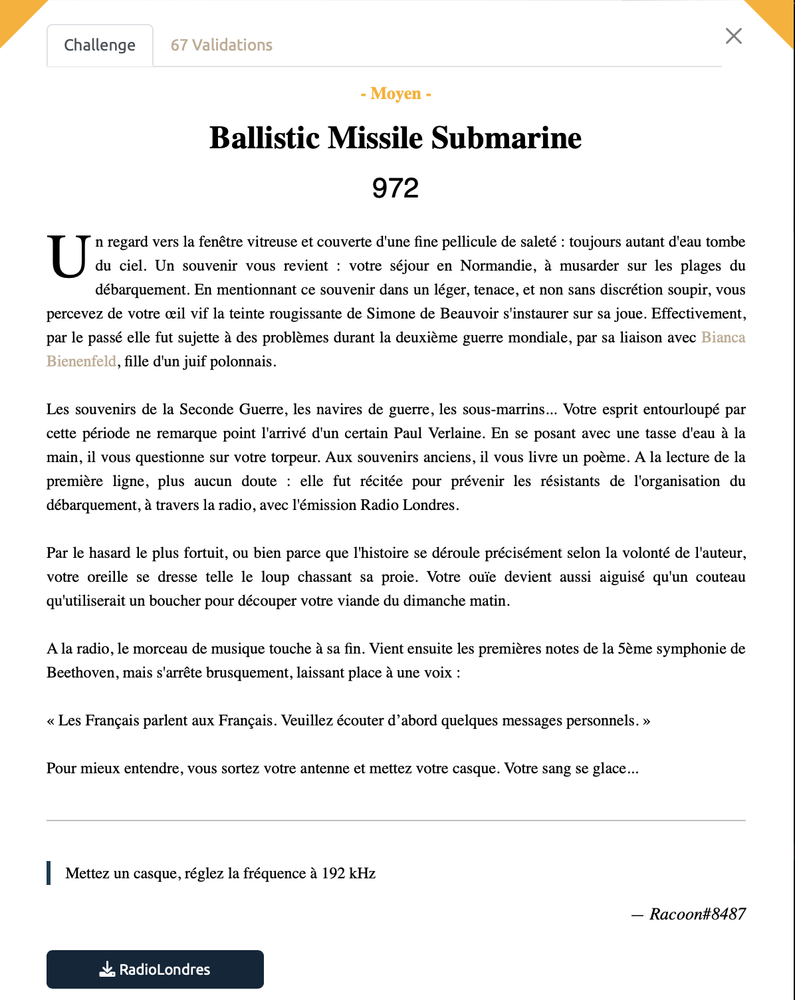
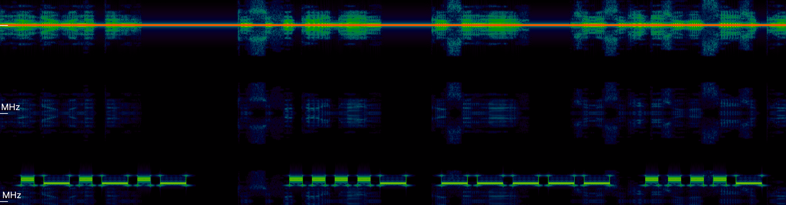

# Ballistic Missile Submarine - Moyen, 972 points



On ne va pas tergiverser 107 ans, on entend un bruit suspect en arrière plan dans l'enregistrement qui ressemble cruellement à du morse. Difficile à décoder à l'oreille malgré une fine maitrise (***cough cough***) du morse. 

On ouvre alors le fichier dans `Inspectrum` et là on découvre en effet des traces suspectes dans le spectogramme. 



On la décode fastidieusement pour obtenir la séquence suivante:
```··· − ·− ·−· − ·−·−·− ····− −−−−− ····− −·−· − ··−· ·−·−·− ·− −·−· −·−· −−− ·−·· ·− −·· · ·−·−·− ·−−· ····− ··− ·−·· ··−−·− ···− ···−− ·−· ·−−−− ····− ·· −· ···−− ··−−·− ···−− ····· − ··−−·− ··− −· ··−−·− −− −−−−− ·−· ····· ···−− ··−−·− ··−−·· ·−·−·− ·− −·−· −·−· −−− ·−·· ·− −·· ·```

Enfin, le temps passé en cours de philo à apprendre le morse sert à quelque chose, on obtient la séquence suivante, par [ici](https://www.dcode.fr/code-morse) ça marche aussi:
```START.404CTF.ACCOLADE.P4UL_V3R14IN3_35T_UN_M0R53_?.ACCOLADE```


<details>
<summary>Voir le flag :</summary>

***FLAG: 404CTF{P4UL_V3R14IN3_35T_UN_M0R53_?}***
</details>