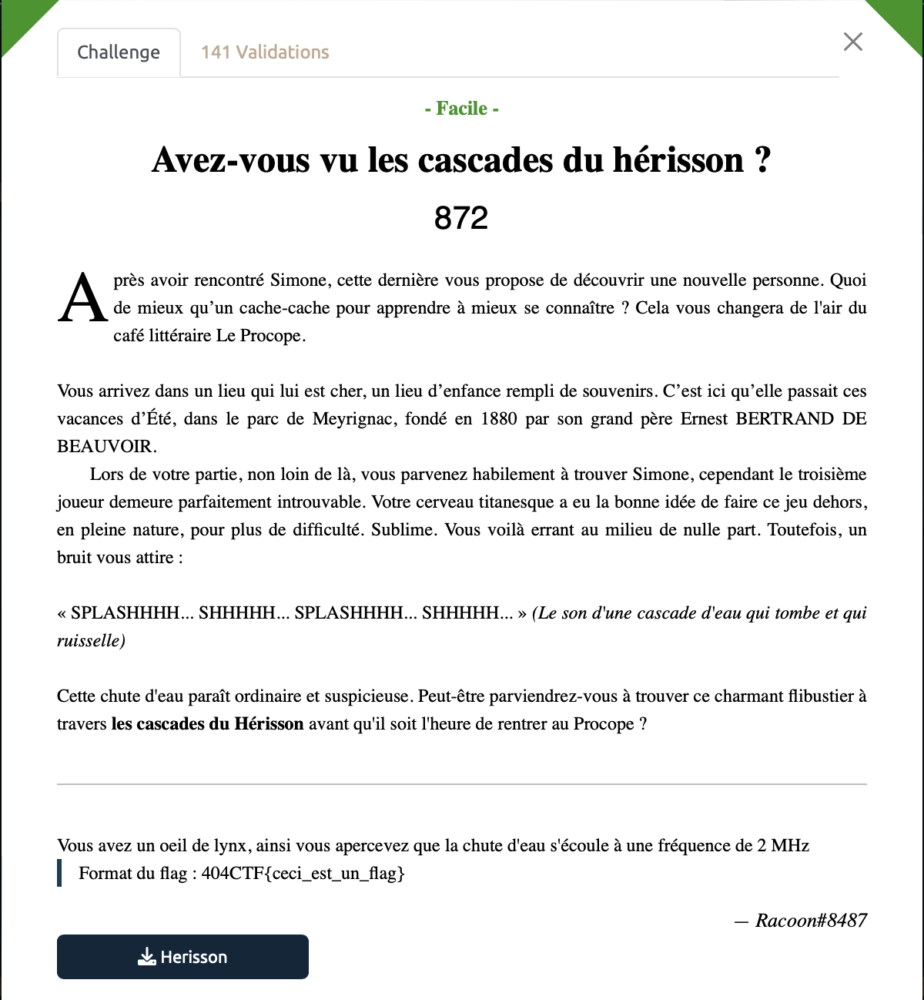
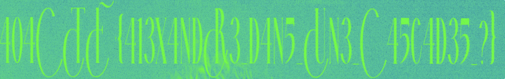

# Avez-vous vu les cascades du hérisson - Facile, 872 points

Aie, on nous parle d'une fréquence de 2MHz, ça fait beaucoup pour `Audacity`, on utilise donc le logiciel `Inspectrum` pour observer le spectrogramme de ce mystérieux signal. 

En jouant un peu avec les paramètres, on découvre vite ce texte caché dans le spectrogramme:

Plus qu'à décoder cette belle police d'écriture d'antan pour obtenir notre sésame. 

Voir le flag :

***FLAG: 404CTF{413X4NDR3_D4N5_UN3_C45C4D35_?}***

