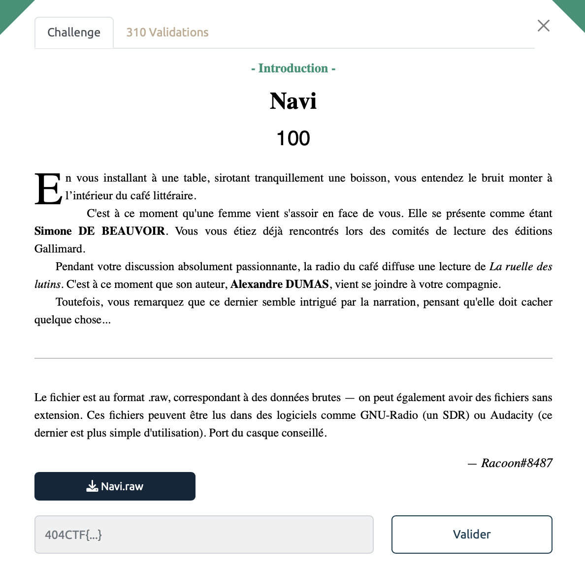

# NAVI - Intro, 100 points

On a ici un fichier raw (données brutes) à notre disposition. On va utiliser `Audacity` pour le faire parler. 

On peut alors écouter un fichier audio d'une quinzaine de minutes. On entend une voix de femme avec une musique de fond. Il y'a néanmoins des bruits suspects qui ressemble à une voix d'homme incompréhensible en arrière plan vers la fin.  

Je crois que je me suis un peu compliqué la vie pour ce challenge et qu'il y'avait plus simple mais voici la démarche réalisée.

On remarque que le fichier audio est un livre audio, celui de *La Ruelle des Lutins* de Alexandre Dumas. Coup de bol le fichier MP3 est disponible au téléchargement au lien [suivant](https://www.audiocite.net/livres-audio-gratuits-nouvelles/alexandre-dumas-la-ruelle-des-lutins.html?). 

On en profite pour le télécharger, l'objectif va être de combiner notre fichier `NAVI.raw` avec celui, immaculé venant d'internet pour qu'il ne reste plus que le bruit de fond. 

Voici la démarche suivie:

- On importe les deux fichiers en parralèle dans Audacity.
- On transforme la piste stereo en mono (Mix > Mix Stereo Down to Mono)
- On utilise Effect > Inverse pour inverser la polarité de l'onde sonore du livre audio. 
- On sélectionne ensuite les 2 pistes et on va les fusionner avec Project> Quick Mix

Enfin on obtient un fichier avec quasiment plus que la voix que l'on entendait en arrière plan. 

On aimerait avoir finit mais pourtant la voix reste inaudible, on dirait de l'allemand, surprenant... 
On joue alors avec la fréquence mais toujours rien. C'est finalement en utilisant l'outil Effect > Reverse que l'on obtient une séquence très claire contenant [le message suivant](./flag_navi.mp3).

 >"La solution est en hexadécimal : 34 30 34 43 54 46 7b 31 74 72 30 5f 34 55 78 5f 52 34 64 31 30 2d 66 52 33 71 55 33 4e 63 33 35 7d"

Il ne reste plus qu'a utiliser notre ami [Cyberchef](https://gchq.github.io/CyberChef/) pour trouver notre bonheur.

Voir le flag :

***FLAG:  404CTF{1tr0_4Ux_R4d10-fR3qU3Nc35}***

