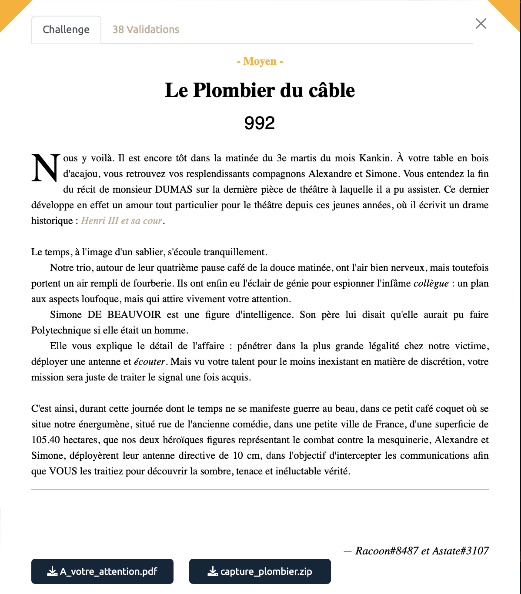
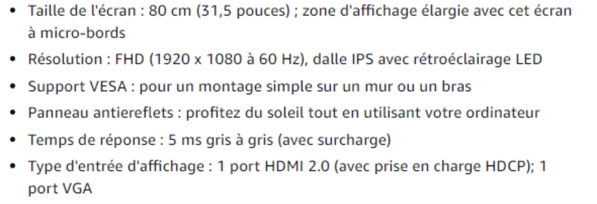
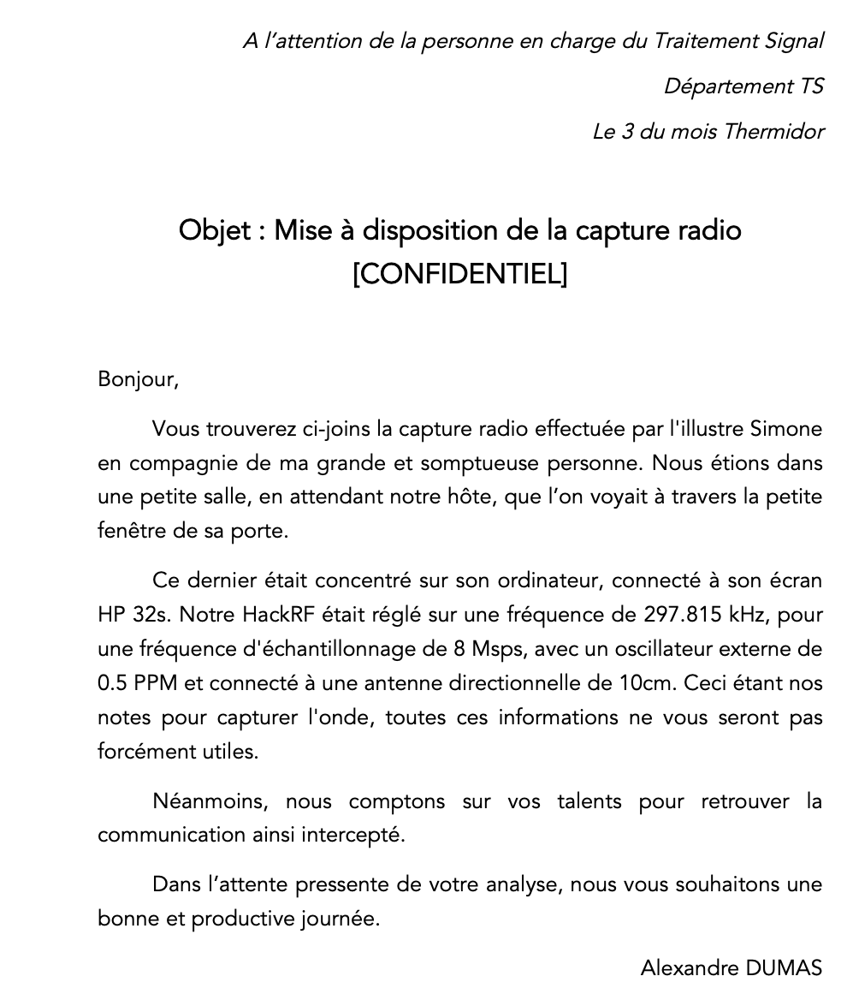
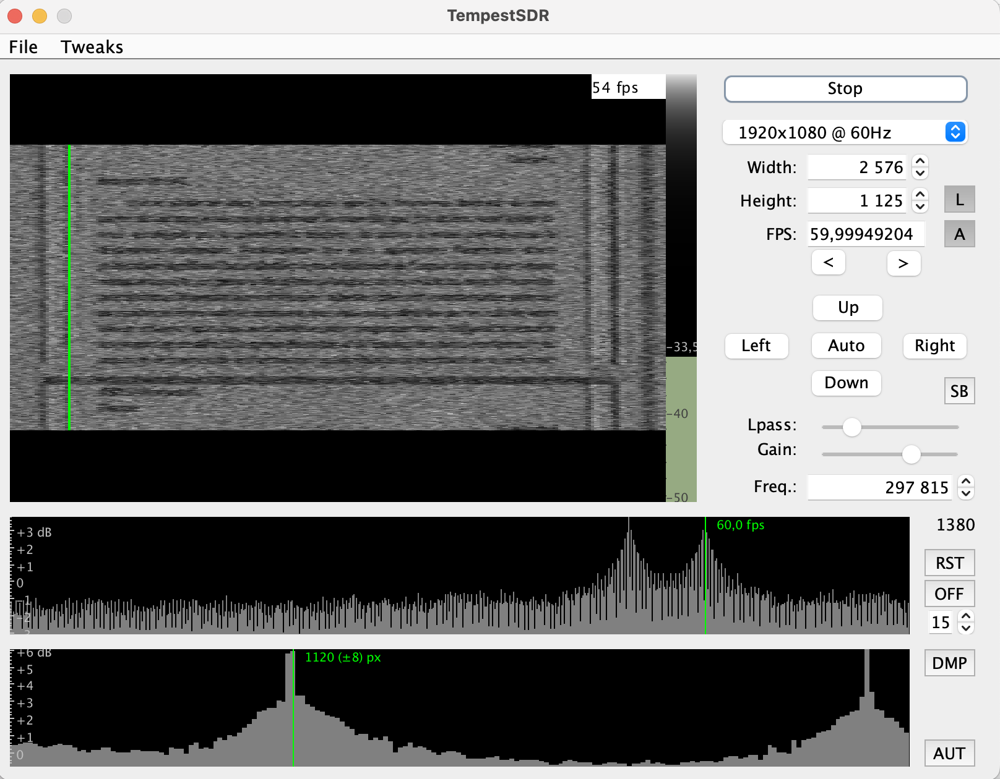
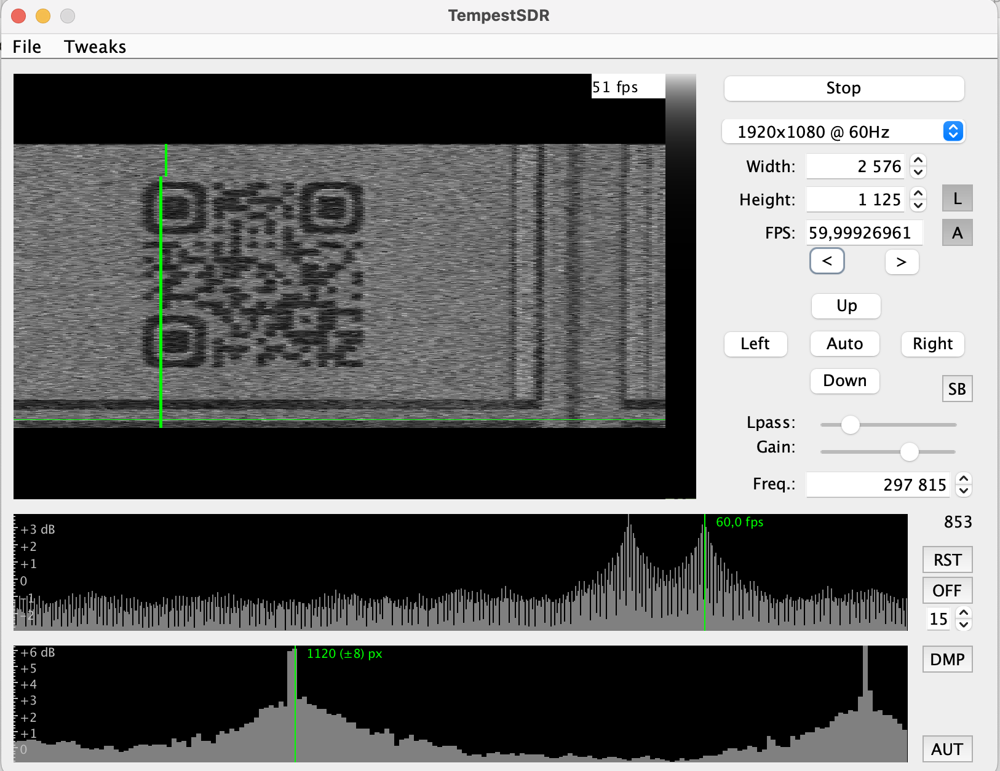
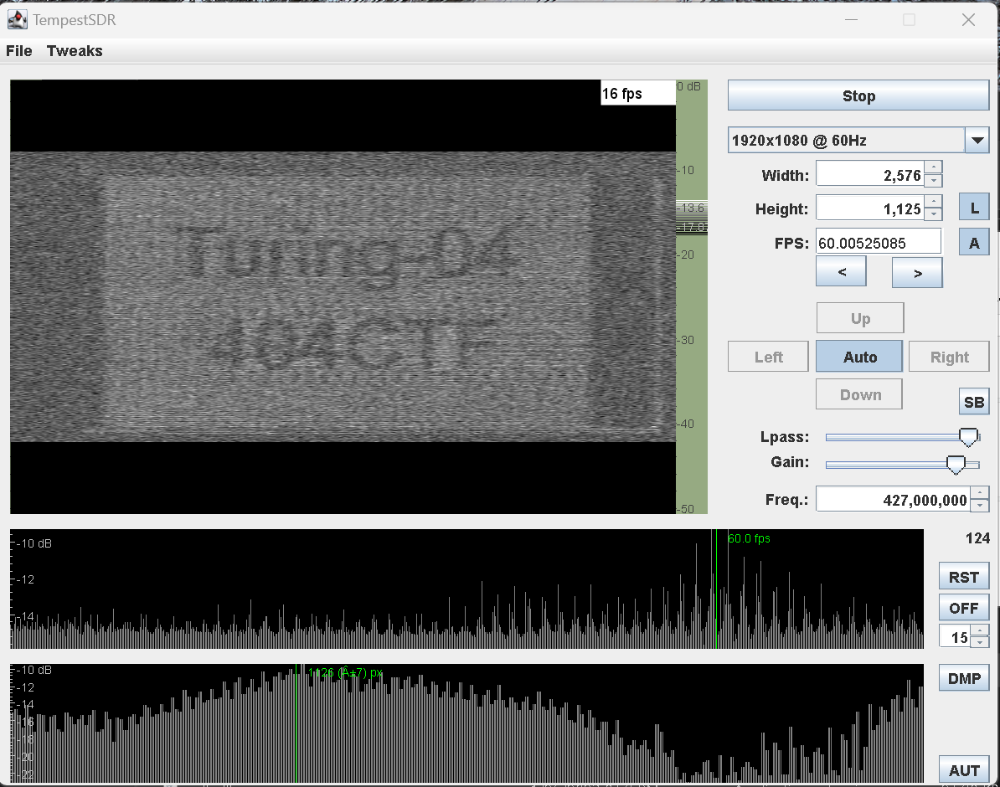

# Le Plombier du câble - Moyen, 992 points

Sans doute l'un des challenge que j'ai le plus apprécié de ce CTF. 

Nous avons un fichier `.raw` de quasiment 5Go à notre disposition accompagné d'un document PDF faisant mention de capture radio sur un ordinateur HP32s avec un HackRF. 

Ayant l'habitude de faire des "expériences" avec mon HackRF, j'avais déjà entendu parler d'une technique avancée permettant grace aux ondes émises par un cable HDMI, d'afficher le contenu d'un écran (par *eavesdropping*). Ça faisait longtemps que je voulais essayer mais je n'avais jamais essayé faute de temps et croyant que c'était sans doute trop compliqué et réservé à des services de pointe en labo. 

Concrètement [(source)](https://www.rtl-sdr.com/?s=tempestSDR): en intercéptant avec le HackRF One les ondes radios *garbages* émises par un cable HDMI vers 295kHz, celles ci peuvent être récuperées et grace à l'outil Tempest SDR, nous pouvons transformer ces ondes en affichage en temps réel.

Ici, une fois que l'on a compris ce qu'il fallait faire, ce n'est plus très compliqué, il suffit de télécharger le fameux logiciel [Tempest SDR](https://github.com/martinmarinov/TempestSDR) et d'y importer notre fichier `.raw`.

On règle également les paramètres en utilisant les données indiquées par le fichier PDF fourni et les informations disponible sur l'écran `HP32s` (notamment que c'est du 1080p à 60Hz). 

<table>
  <tbody>
    <tr>
      <td></td>
      <td></td>
    </tr>
  </tbody>
</table>

Et là, miracle on obtient un flux vidéo dans lequel on vois que notre victime joue à tétris puis se balade sur un éditeur de texte avant de voir apparaître un QR-code :

Il ne reste plus qu'à scanner ce QR code pour obtenir notre flag. 

Voir le flag :

***FLAG:  404CTF{4rR3tE_De_m_e$pi0Nn3R}***

Incroyable n'est ce pas? On se croirait dans un film d'espionnage américain. Je me suis dit que c'était un peu trop beau pour être vrai tout ça alors j'ai sorti mon HackRF pour voir si ça fonctionne vraiment, et à ma grand suprise oui !

Après pas mal de galère et de bidouillages (en particulier pour trouver la bonne fréquence):

Bon ca reste peu réaliste comme technique d'espionnage mais ça nous laisse un peu imaginer ce dont un service étatique pourrait être capable avec des équipements et des techniques plus avancées ... 