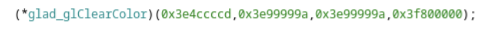

# L'inspiration en image - Facile, 863 points

***

On a un fichier ELF executable [à notre disposition](./vue_sur_un_etrange_tableau) ainsi qu'un énigmatique fichier texte contenant les informations suivantes:

> 24p6UjIlgyu8uEC5V48f3FmColpW2SfS9voGI/ybfEBCEAibHEl2tbQNFxei2Frf/VE10FqN8EiGy80SLvMwnzajiGJz5z22SeYhwwMLByHMev8W691hXtKh826znmBm4d0o6LKKJ8mC+2NkaCgtr4FiwyTo+mSE50Dtfwa0r2sQXMzKLpR+8xOUO4uxA6SpB2zNA+jUlmaGkO3lWyJzQvsx9JRqERiPdE5pxsvRLDZ42kX6oteGtE8rBV/gkz/Vslgxe5axNocEO9Vpmy5JbfzY2CyLX6232Uoe+y7sAtMW+LJudtmvxiazzH7nduoAhyoimJDXj3OinBTCzpDhROVtP1XNPaEZc/yzYngnkvdWsKz+XmvGEuZRtys1cFiE
> 
> openssl enc -aes-256-cbc -md sha512 -pbkdf2 -iter 250000 -nosalt -in message.txt -out chiffré.txt

On commence par décompiler le fichier exécutable grâce à BinaryNinja afin de chercher des informations dans [le fichier C](./binary_ninja_decompilated.c) que l'on obtient.

On regarde très vite ce qui se passe dans le main mais on ne trouve rien de bien probant le fichier fait plus de 3000 lignes et n'est pas très lisible. On pourrait creuser un peu plus jusqu'à trouver trouver notre bonheur mais on va plutot utiliser [Ghidra](https://ghidra-sre.org) pour voir si l'on obtient quelque chose de plus clair. 

Et en effet c'est déjà beaucoup mieux. En analysant les différentes fonctions, on s'intéresse très vite au `main` dans laquelle on découvre un appel à `glad_glClearColor` qui prend 4 arguments, il pourrait bien s'agir de nos fameuses valeurs RGBA:

On utilise alors un [outil en ligne](https://www.scadacore.com/tools/programming-calculators/online-hex-converter/) pour convertir ces fameuses valeurs en float (comme demandé dans l'énoncé).

On part des fameuses passées en argument de la fonction `glad_glClearColor` (0x3e4ccccd, 0x3e99999a, 0x3e99999a, 0x3f800000) et on obtient (0.2,0.3,0.3,1.0).

Et voilou, plus qu'à les wrap comme demandé dans l'énoncé pour valider le challenge.

Voir le flag :

***FLAG: 404CTF{vec4(0.2,0.3,0.3,1.0)}***

