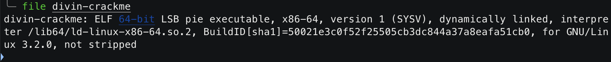

# Le Divin Crackme - Intro, 100 points

***

On commence par utiliser `file` sur le fichier [divin-crackme](./divin-crackme) pour obtenir un peu plus d'informations.

On découvre ainsi qu'il s'agit d'un fichier C compilé. 

On utilise alors la commande `strings` pour voir s'il se cache des choses intéressantes dedans.

Bon le programme semble demander un mot de passe puis le vérifier, sans doute en le comparant avec des morceaux de flag que l'on semble apercevoir "Ph13_d4N5 ...". 
Et en bas on découvre également que le compilateur `GCC` a été utilié sur une machine Debian. 

Il nous reste plus qu'à trouver la fameuse fonction et le mot de passe. 

On utilise [ce site](https://dogbolt.org) pour décompiler notre binaire et obtenir [ce fichier](./decompiled_divin.c) en C. 

Il y'a un peu de junk dans ce fichier, mais on découvre rapidement vers la ligne 130 que la function `strncmp` est utilisée pour vérifier si l'entrée utilisateur est correcte en la comparant à des séquence de caractères bien précise (qui sont d'ailleurs celles que l'on avait trouvé suspectes en utilisant strings dans le shell). 

En assemblant les chaînes de caractères ensemble on obtient alors le mot de passe recherché: `L4_pH1l0soPh13_d4N5_l3_Cr4cKm3`!

On peut maintenant vérifier si le mot de passe trouvé est bien correct en exécutant le fichier:

Et en effet c'est correct. Il ne reste plus qu'à rassembler les informations que nous avons trouvé pour obtenir notre flag.

Voir le flag :

***FLAG: 404CTF{gcc:strncmp:L4_pH1l0soPh13_d4N5_l3_Cr4cKm3}***

