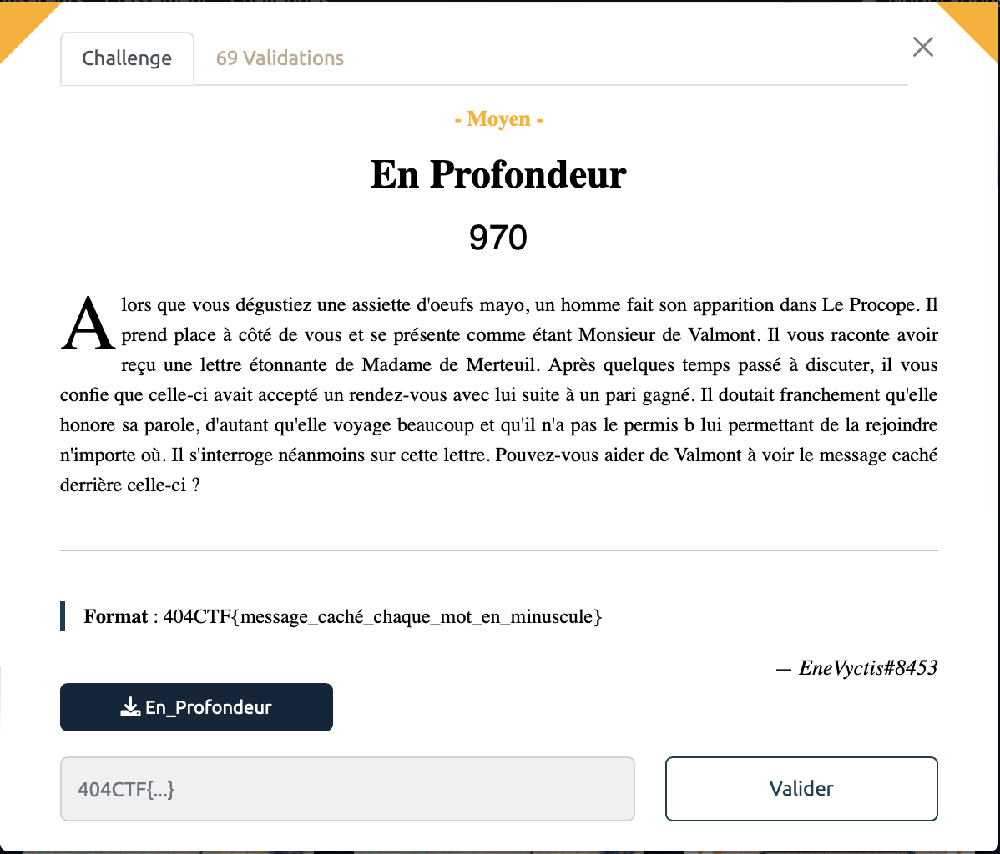
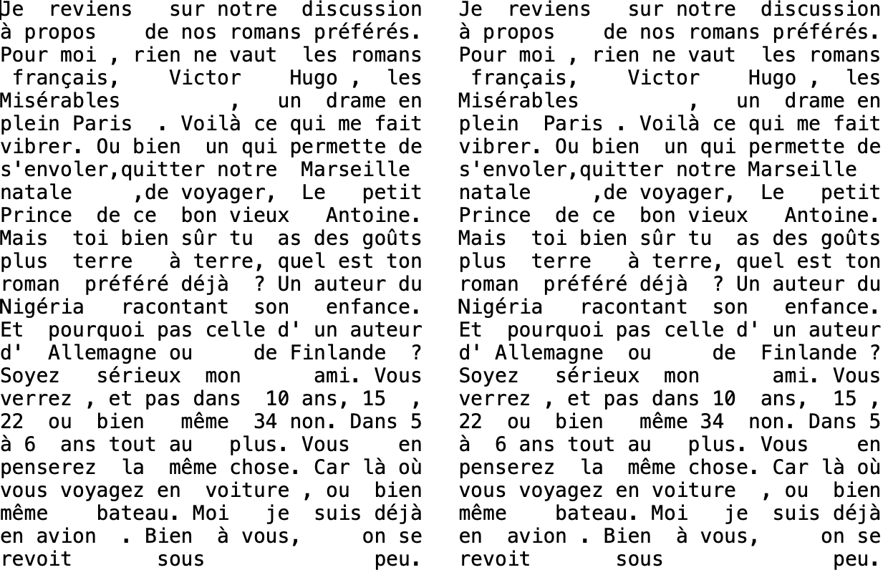

# En profondeur - Moyen, 970 points

On a à notre disposition deux textes en apparence identiques:

Et pourtant que nenni ! En jouant avec gimp en superposant les deux textes et en ajoutant de la transparence, on observe des décalages suprenant entre certains mots bien spécifiques. 

Je n'ai plus l'image de la superposition sous la main, mais c'est assez flagrant, ca peut également se voir avec un notepad en regardant les différences dans la gestion des espaces. 

Une liste de mot ressort alors: `Paris Marseille Allemagne Finlande 10 15 34 6 voiture avion`.

Vous me direz, c'est bien joli tout ça, mais il est où le flag mon coco? Eh bien il est sous vos yeux mes chers. 

On a parlé de décalage entre les deux textes tout à l'heure en réalité pour certains mots ce décalage est dans un sens et pour d'autres il est dans un autre sens. 

On obtient alors deux listes distinctes de mots et donc deux flags différents possible :
- 404CTF{paris_finlande_15_6_avion}
- 404CTF{marseille_allemagne_10_34_voiture}

On pourrait alors lire l'énoncé pour comprendre la logique derrière et trouver lequel des 2 est correct. Mais bon, vu le nombre de théories fumeuses essayées avant d'en arriver là, on a plus le temps pour ça. On essaye donc les deux et BINGO. 

Voir le flag :

***FLAG: 404CTF{paris_finlande_15_6_avion}***

