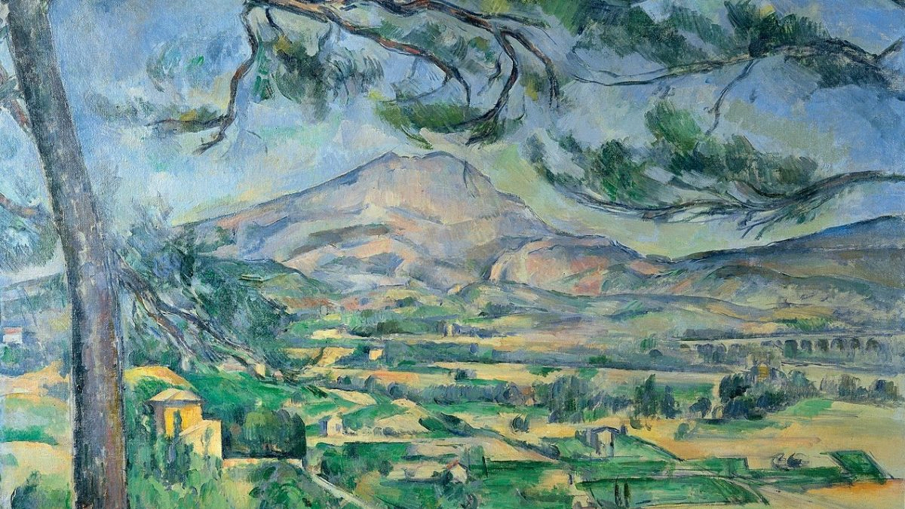

# L'Œuvre - Facile, 200 points

***

Les plus esthètes d'entre nous auront bien entendu reconnu *La Montagne Sainte-Victoire vue de Bellevue* de Paul Cézanne. 

Mais en y regardant de plus près avec [Aperisolve](https://aperisolve.com), on découvre qu'un message est caché derrière cette innocente huile sur toile lorsque l'on joue avec les plans de couleur:

Et voila c'est déjà fini !

Voir le flag :

***FLAG: 404CTF{C3z4nne3_ouVr3_To1}***

