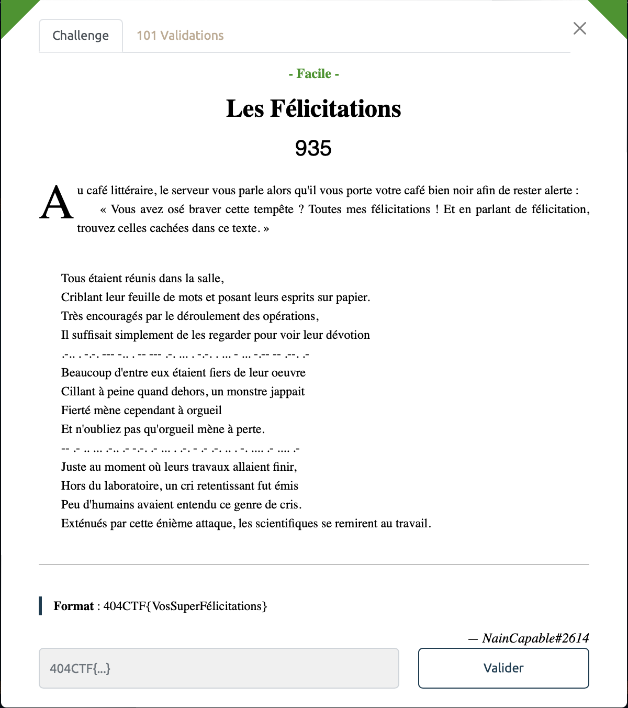
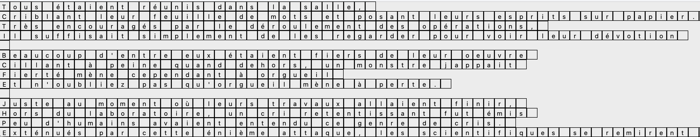

# Les félicitations - Facile, 935 points

On retrouve un peu de morse entre les lignes, ca semble trop beau pour être vrai mais bon ne sait-t'on jamais. Grâce à notre maitrise du morse savamment apprise au Lycée au lieu d'écouter les profs, on décode cette mystérieuse séquence et on obtient:

> .-.. . -.-. --- -.. . -- --- .-. ... . -.-. . ... - ... -.-- -- .--. .-
> LECODEMORSECESTSYMPA

> -- .- .. ... .-.. .- -.-. .- ... . .-. - .- .-. .. . -. .... .- .... .-
>  MAISLACASERTARIENHAHA

Décidemment, les créateurs ne manquent pas d'humour.

On se casse alors la tête à trouver quelque chose et dieu sait que ca m'a coûté des neurones.

Finalement, grâce au script [suivant](./script.py), on cherche des patterns dans le texte, pour voir s'il n'y a pas un message caché quelque part. 

On obtient alors cette belle grille:

Et là BINGO, en utilisant les skills acquis dans notre plus tendre enfance, on découvre qu'il y'a un mot caché pour chacune des trois zones de textes selon le modèle suivant: première lettre de la première ligne, deuxième lettre de la 2e ligne et ainsi de suite.

Pour la première strophe ça donne ça: (les caractère qui nous intéresse sont en majuscule)

>Tous étaient réunis dans la salle,  
>cRiblant leur feuille de mots et posant leurs esprits sur papier.  
>trÈs encouragés par le déroulement des opérations,  
>il Suffisait simplement de les regarder pour voir leur dévotion 

On extrait ainsi le mot `Très`. Il ne reste alors plus qu'à faire de même pour les autres strophes. 

On obtient alors nos ***félicitations*** pour être allé au bout de ce challenge:

Voir le flag :

***FLAG: 404CTF{TrèsBienJoué}***

