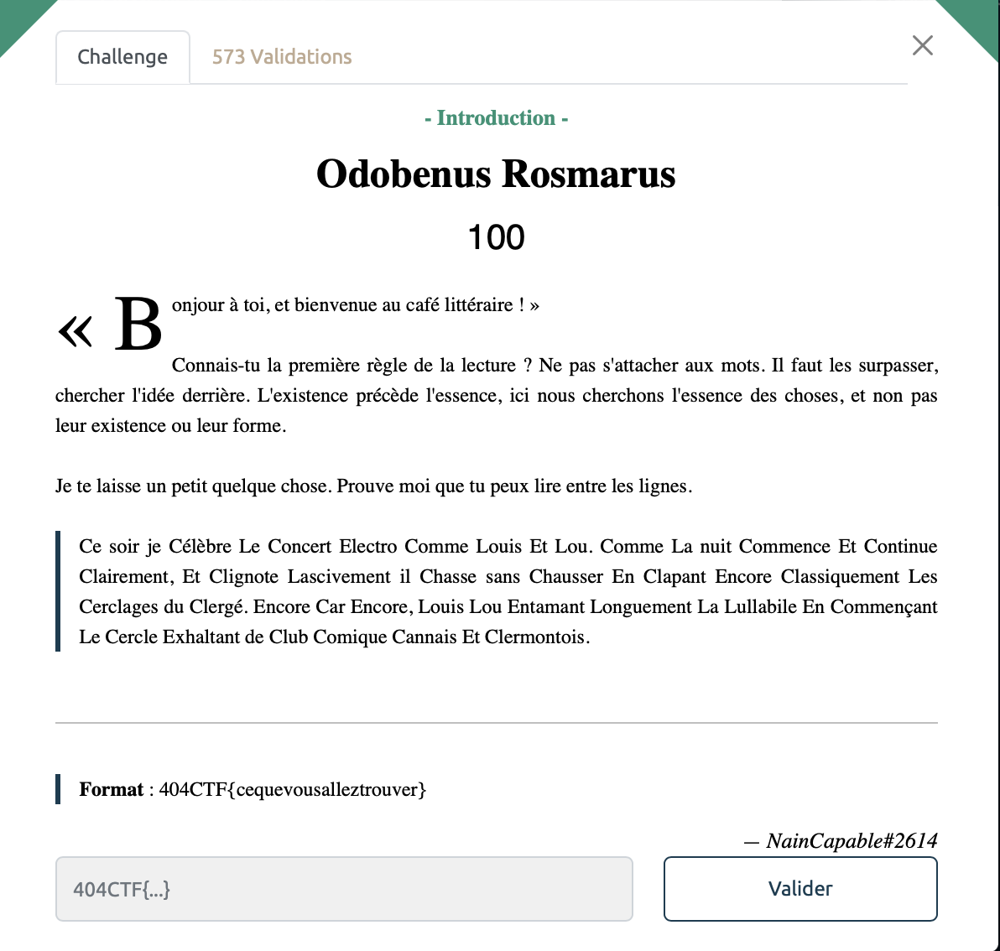

# Odobenus Rosmarus - Intro, 1OO points

> Ce soir je Célèbre Le Concert Electro Comme Louis Et Lou. Comme La nuit Commence Et Continue Clairement, Et Clignote Lascivement il Chasse sans Chausser En Clapant Encore Classiquement Les Cerclages du Clergé. Encore Car Encore, Louis Lou Entamant Longuement La Lullabile En Commençant Le Cercle Exhaltant de Club Comique Cannais Et Clermontois.

On remarque assez vite quelque chose de surprenant, la plupart des mots commencent par des lettres en majuscule, toujours des C, des L ou des E. 

Par ailleurs le titre du challenge fait référence au nom scientifique du morse (l'animal). 

On en déduit alors que les C correspondent a des impulsions Courtes, que les L correspondent à des impulsions longues et que les E sont les Espaces séparant les différents charactères. 

Plus qu'à retranscrire tout ça avec des ' _ ' et des ' . ', on obtient alors la séquence suivante : 
        
    ..-. .- -.-. .. .-.. . .-.. . -- --- .-. ... .

Plus qu'à ressortir nos connaissances dûrement apprises pendant les cours de philo (ou à utiliser [un outil en ligne](https://www.dcode.fr/code-morse)) pour obtenir notre précieux sésame. 

Voir le flag :

***FLAG: 404CTF{FACILELEMORSE}***

