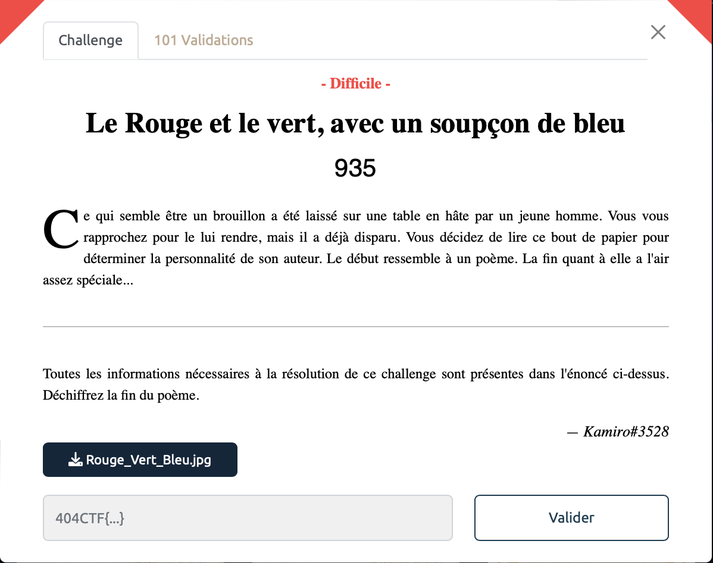
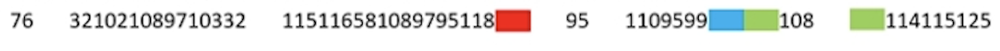

# Le Rouge et le vert, avec un soupçon de bleu - Difficile, 935 points 

***

On a une image à notre disposition avec une ligne composée de chiffres entrecoupée par des blocs de différentes couleurs. Nos efforts vont se concentrer sur cette ligne.

On copie cette étrange série de chiffres en remplacant les blocs blanquants par des espaces. On obtient la séquence suivante:

    76 321021089710332 115116581089795118  95 1109599  108  114115125 

On peut alors utiliser [un outil en ligne](https://www.dcode.fr/ascii-code) pour décoder cette séquence qui ressemble à de l'ASCII. On obtient alors la séquence suivante:

    L flag st:la_v_n_clrs}

Ca ressemble bien à un flag, bonne nouvelle on est sur la bonne piste !

On déduit très rapidement que la phrase commence par "Le flag est ...".
Le bloc blanc correspond donc a la lettre 'e', c'est à dire à la valeur 101 en ASCII. En remplacant les autres blocs blancs par 101 et en déduisant facilement les lettres restantes on obtient alors notre flag.

Voir le flag :

***FLAG: 404CTF{la_vie_en_couleurs}***

