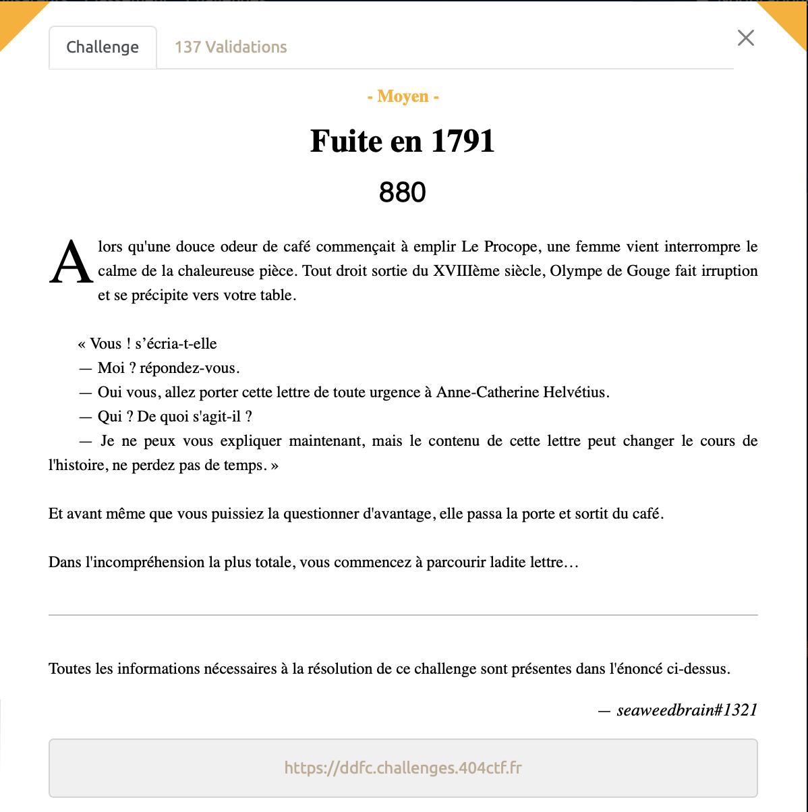
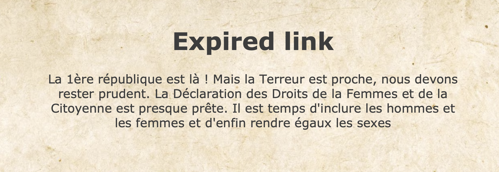
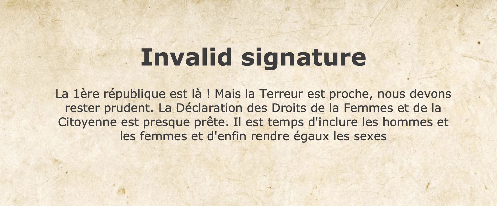

# Fuite en 1791 - Moyen, 880 points

***

Lien: https://ddfc.challenges.404ctf.fr

On arrive sur la page suivante:

En essayant d'accéder à la Déclaration des droits de la Femme et de la citoyenne, nous sommes acceuillis avec le message suivant:

Hmm, suprenant. En regardant de plus proche l'URL, on remarque le paramètre suivant `expiry=-5625891076`. En utilisant un [convertisseur d'epoch](https://www.epochconverter.com) en ligne, on se rend compte que cette valeur correspond au 21 September 1791, soit plus d'une semaine après sa rédaction or Olympe de Gouges nous a indiqué qu'elle n'est valable qu'une seule semaine. 

On peut essayer de modifier la valeur d'expiry pour une date dans le futur néanmoins on obtient alors l'erreur suivante:

En effet, l'URL auquel on accède contient une valeur `expiry`, ainsi qu'une `signature`: https://ddfc.challenges.404ctf.fr/ddfc?expiry=-5625891076&signature=wawF6dC4Hz9g5NyCc3j1KCDcfztFE/sp

Dès que l'on essaye de modifier la valeur de expiry, la signature devient incorrect. On regarde alors comment est ce que la signature pourrait être modifiée pour être reconnu mais ca semble bien compliqué, il faut sans doute chercher autre part.
En cherchant les vulnérabilités possibles dans les paramètres d'un URL, on découvre le "[Parameter Pollution](https://book.hacktricks.xyz/pentesting-web/parameter-pollution)". L'idée est de duper le serveur dans sa gestion des paramètres en rajoutant des paramètres à la fin de notre URL pour bypasser le problème que nous avions avant.

On va donc essayer de modifier expiry en rajoutant une nouvelle valeur valide à la fin de l'URL. Par exemple:
https://ddfc.challenges.404ctf.fr/ddfc?expiry=-5625891076&signature=wawF6dC4Hz9g5NyCc3j1KCDcfztFE/sp&expiry=99999999999

On accède alors à la Déclaration des Droits de la Femme en entier (inutile que je vous mette la capture d'écran, vous la connaissez forcément déjà par coeur) et caché en bas de la page, on trouve notre bonheur !

Voir le flag :

***FLAG: 404CTF{l4_p011uti0n_c_3st_m41}***

