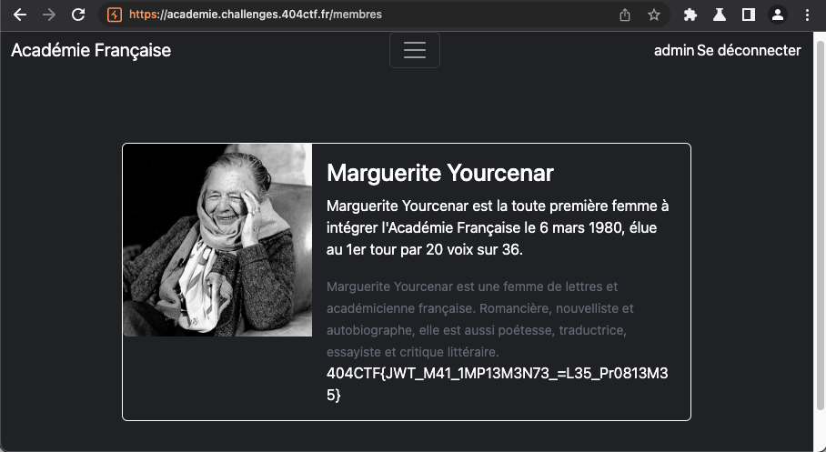

# L'Académie du détail - Facile, 200 points

***

lien : https://academie.challenges.404ctf.fr

Nous arrivons sur une page d'acceuil où l'on peut se connecter, on ne voit rien d'intéressant dans le code source de la page. 

On va alors regarder du côté de la connexion. En essayant le couple username/mdp "admin/admin", on obtient l'erreur "mot de passe incorrect". Rien de bien surprenant ca aurait été trop facile. Il en va de même en essayant d'autres mots de passes courant du style "password". En revanche, en essayant n'importe quel autre nom d'utilisateur du type "bonjour" ou "test", on arrive à se connecter sans soucis. 

Néanmoins en essayant d'accéder à la liste des membres on est reçus par le message suivant:

Tiens donc, comme ça nous sommes le grand public ? Il va falloir trouver un moyen de se faire passer pour l'admin ! 
En regardant de plus prêt les quêtes dans `BurpSuite`, on se rend compte que le programme utilise des tokens JWT. 

En utilisant le plugin JWT de burp, on en apprend un pue plus sur le contenu de ce fameux cookie:

On peut alors utiliser la fonctionnalité "attack" (en bas à gauche) dans Burp et sélectionner "none" Signing Algorithm et modifier la valeur de username avec "admin" pour voir si le serveur accepte aussi les tokens sans signature (une faille connue avec les JWT).
On obtient alors le payload suivant: (on note bien la présence d'un point à la fin juste avant l'endroit où il y'a normalement la signature, j'ai perdu beaucoup de temps à essayer de forger l'attaque manuellement en transformant le payload en base64 et en supprimant le field signature ainsi que le point final qu'il fallait en fait garder ! )

Il ne reste plus qu'à "forward" notre requête modifiée grâce au proxy de `Burp`, on arrive alors sur la page suivante:

Voir le flag :

***FLAG: 404CTF{JWT_M41_1MP13M3N73_=L35_Pr0813M35}***

