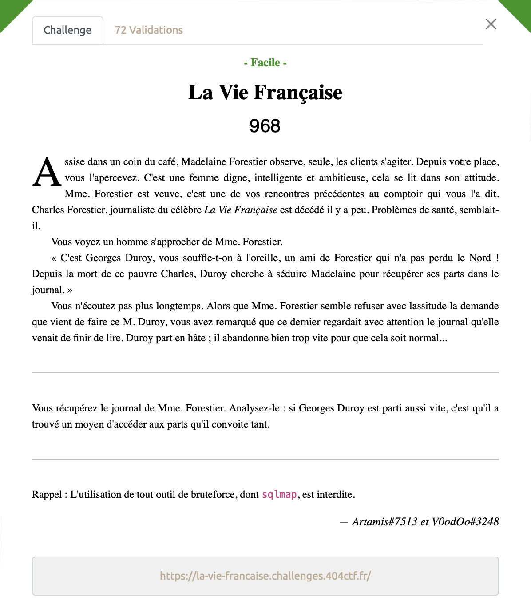
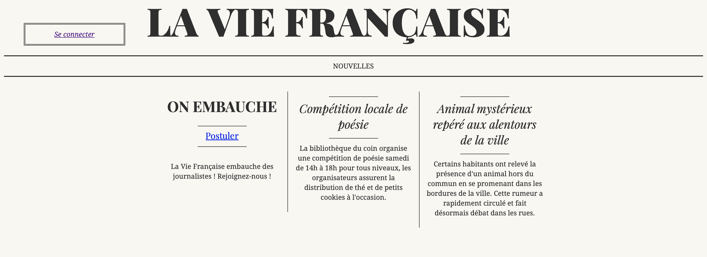
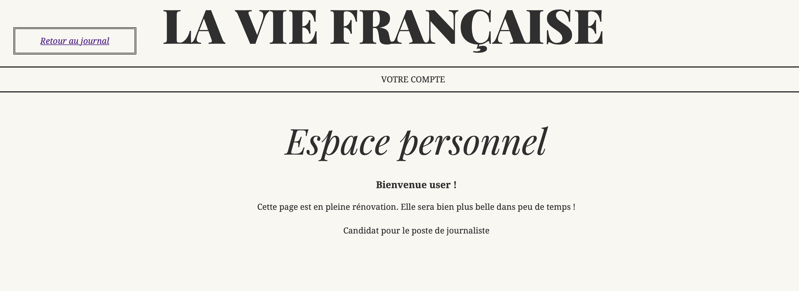
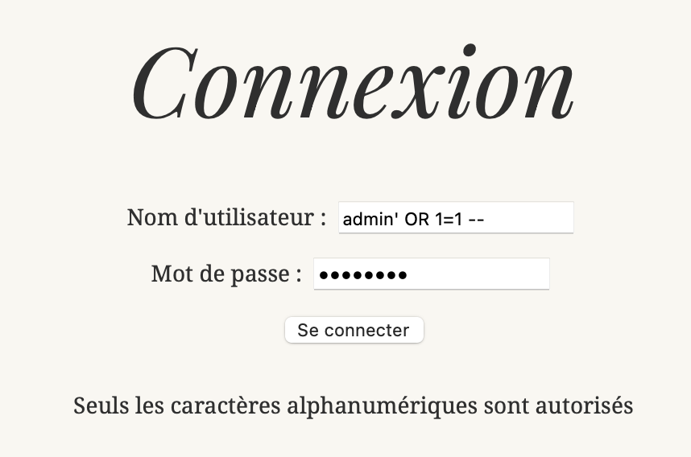
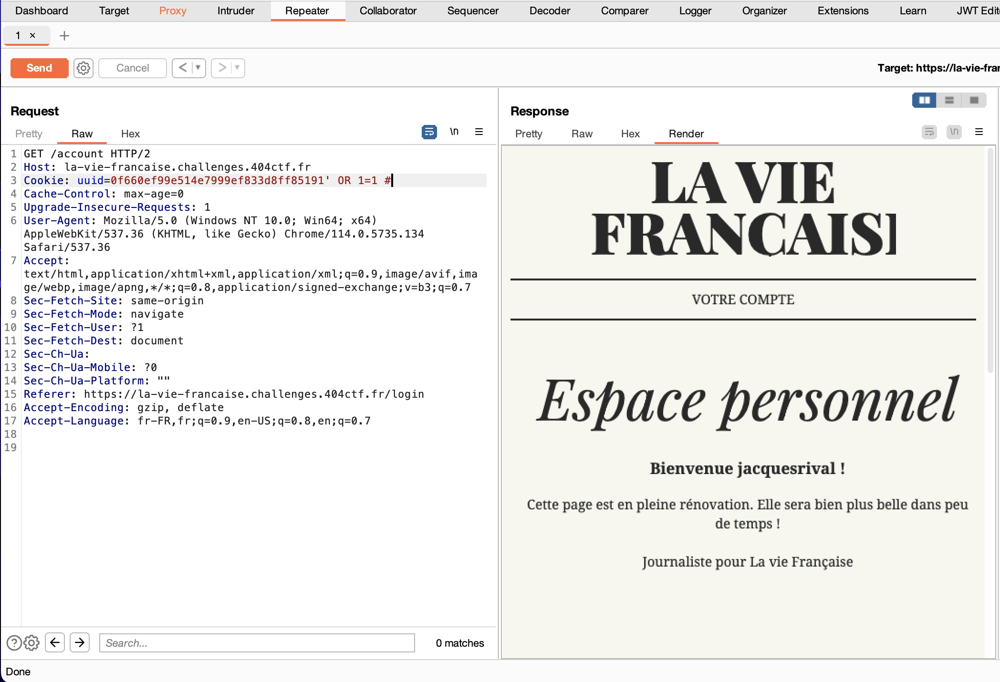
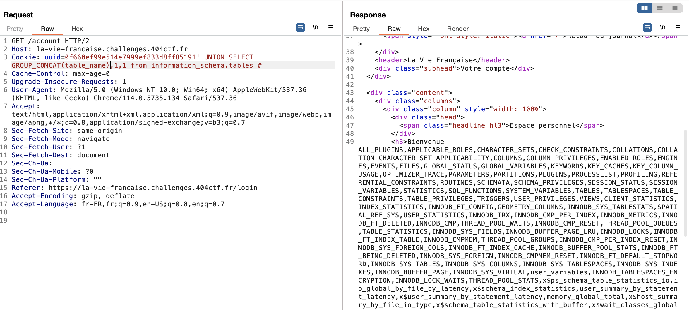
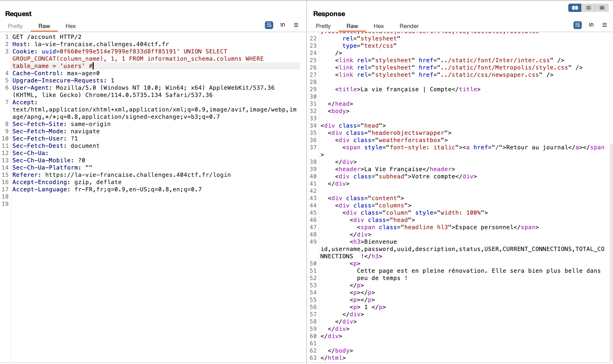
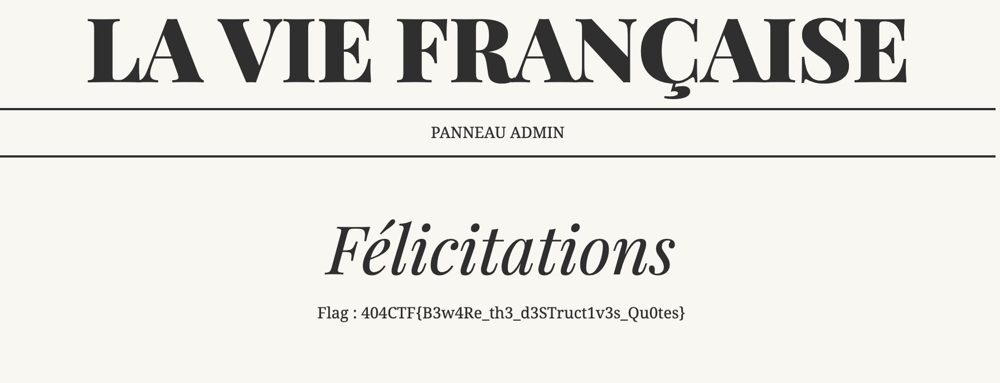

# La vie Française - Facile, 968 points



***

Lien : https://la-vie-francaise.challenges.404ctf.fr

Nous arrivons sur une page web avec des liens nous permettant de postuler ou de nous inscrire. 



On essaye de se connecter avec le username 'admin', néanmoins il y'a un message d'erreur, cela n'est pas possible. On se connecte alors avec le username user et un mot de passe random et là tout à l'air de fonctionner, on arrive à créer un compte et à s'y connecter.




On essaye alors de faire une injection SQL, néanmoins on se retrouve vite coincé car le site web renvoie un message d'erreur dès qu'on essaye d'utiliser des caractères spéciaus. Voila de quoi compliquer notre tache ...



Hmm, comment va t'on bien pouvoir trouver notre flag. Et si on essayait de faire une SQLi dans les cookies ? Je n'ai jamais essayé mais il parait que c'est possible. 
En essayant plusieurs combinaisons possible on finit par faire mouche (on utilise un # à la fin pour commenter le reste de la ligne, ici le classique "--" final ne fonctionne pas):




Magie, on est maintenant connecté au compte de jacquesrival alors que l'on était connecté au compte "user". 

On va maintenant essayer de découvrir le type de DB utilisé, pour cela on utilise le mot clé "UNION", attention néanmoins au problème de format que l'on pourrait rencontrer. 
On commence par dump le nom des tables grâce au payload suivant:
```SQL
' UNION SELECT GROUP_CONCAT(table_name), 1, 1 FROM information_schema.tables#
```
On utilise la fonction mySQL `GROUP_CONCAT()` afin de merge les données de plusieurs lignes en un seul field pour que ne pas avoir de problème de format lié à l'utilisation de UNION.

On obtient les informations suivantes:


Nous allons nous focaliser sur le contenu de la table "User" en récupérant le nom de ces colonnes au moyen du payload suivant:
```SQL
' UNION SELECT GROUP_CONCAT(column_name), 1, 1 FROM information_schema.columns WHERE table_name = 'users' #
```




 Maintenant que l'on connait le format attendu et le nom des tables on peut utiliser les payload suivants pour trouver les noms d'utilisateur et les mots de passe des différents utilisateurs:
```SQL
' UNION SELECT GROUP_CONCAT(username), null, null FROM users #
```
```SQL
' UNION SELECT GROUP_CONCAT(password), null, null FROM users # 
```

On peut alors essayer toutes les combinaisons possibles (il y'en a 6).
En essayant de se connecter au compte de `madeleineforestier` avec le mot de passe `fo2DVkgShz2pPJ`, on arrive sur la page suivante (en accédant au panneau admin qui est maintenant disponible):



<details>
<summary>Voir le flag :</summary>

***FLAG: 404CTF{B3w4Re_th3_d3STruct1v3s_Qu0tes}***
</details>
