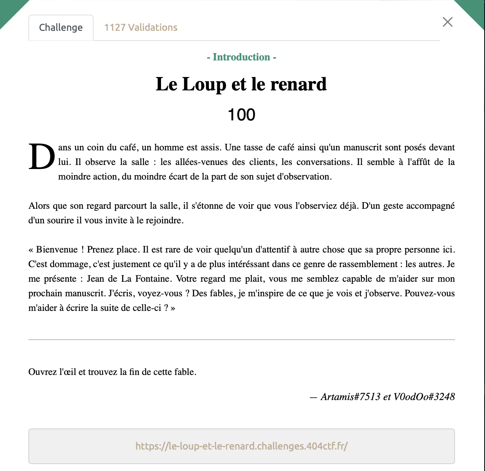
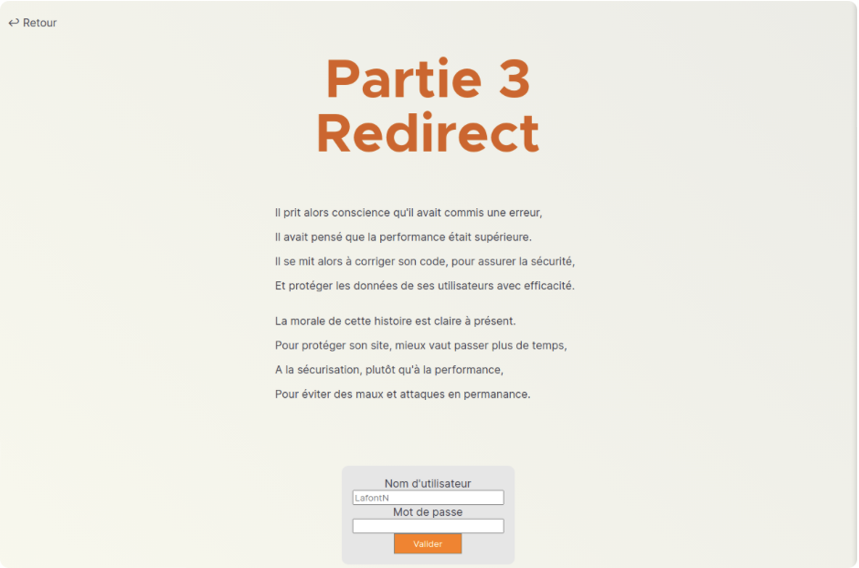
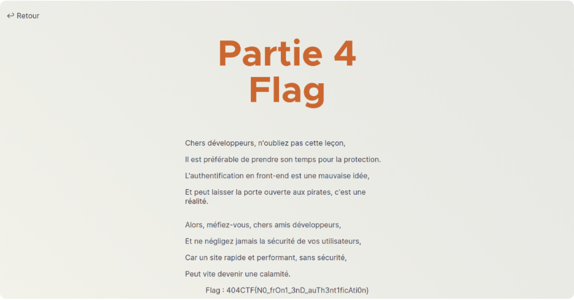

# Le Loup et le renard - Intro, 100 points



***

Ce challenge se fait en 4 étapes et est accessible au lien suivant: https://le-loup-et-le-renard.challenges.404ctf.fr;
Pour se simplifier la vie, nous allons utiliser [Burp Suite](https://portswigger.net/burp), une application de référence pour tout ce qui touche aux exploitations/analyses web.

Pour la première étape, il faut trouver le mot de passe et le nom d'utilisateur. Pour cela, on regarde le code source de la page où on découvre que l'authentification n'est pas réalisée côté serveur comme ça devrait être le cas mais dans le front end, on peut donc récupérer le mot de passe directement en analysant le code source, et plus précisément la fonction suivante:

```js
  // Système d'authentification
  function auth() {
    if (
      document.getElementById("username").value === "admin" &&
      document.getElementById("password").value === "h5cf8gf2s5q7d"
    ) {
      window.location.href = "/fable/partie-2-cookie";
    }
  }
```

On utilise donc les "credentials" indiqués (admin & h5cf8gf2s5q7d) pour passer à la deuxième partie. 

On s'intéresse maintenant aux cookies, on découvre qu'il y'en a qui a une forme très particulière:
```Cookie: isAdmin=false```

En modifiant simplement ça valeur de `false` à `true`, on accède à la partie suivante:



On observe qu'une redirection automatique nous fait passer par une page qui contient le flag avant d'arriver sur la page de la partie 3. On utilise alors la fonction **proxy** de Burp pour intercepter la page qui nous intéresse et récupérer notre flag.



***

<details>
<summary>Voir le flag :</summary>

***FLAG: 404CTF{N0_frOn1_3nD_auTh3nt1ficAti0n}***
</details>