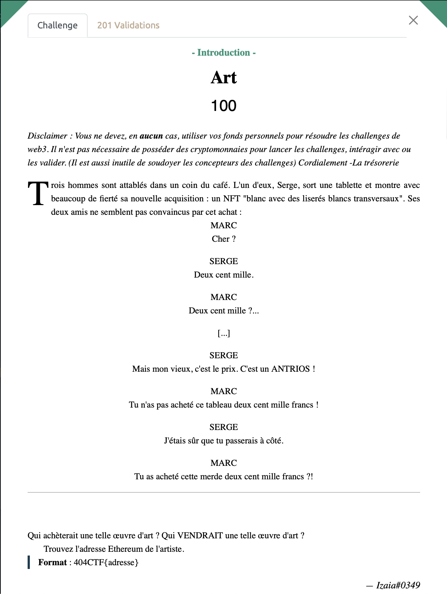

# Art - Intro, 100 points

***

Pour ce challenge d'intro, il fallait retrouver un vendeur de NFT qui avait un lien avec un certain Antrios et qui utilisait la blockchain Etherum pour vendre ces œuvres.
Ca ressemble plus à de l'OSINT qu'à du Web3, ce qui m'arrange bien ! 

On découvre assez rapidement [OpenSea](https://opensea.io), une des plus grosses plateforme de vente de NFT de la toile.

On peut alors chercher l'oeuvre "blanc avec des liserés blancs transversaux pour découvrir l'immense talent de l'artiste dont il est question où alors on peut se contenter de chercher directement Antrios. 

On arrive alors sur son profil d'artiste dans lequel est indiqué son Addresse Ethereum. Ce n'était pas bien sorcier !

Voir le flag :

***FLAG: 404CTF{0xD7186D588Ed2AddF8b260d09B108100f264A64A9}***

