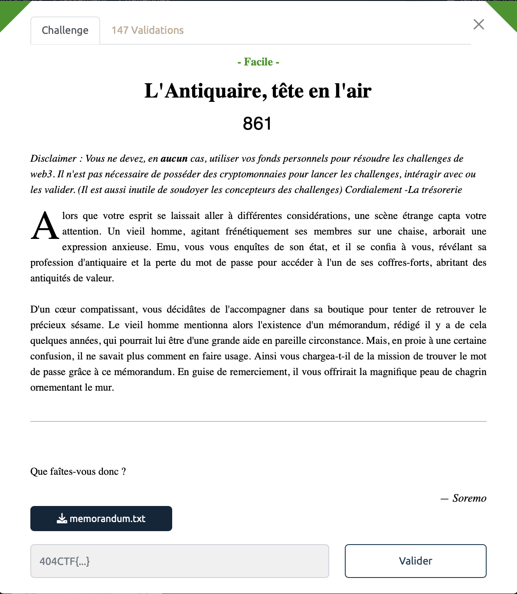
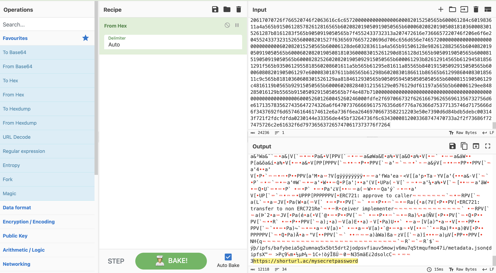
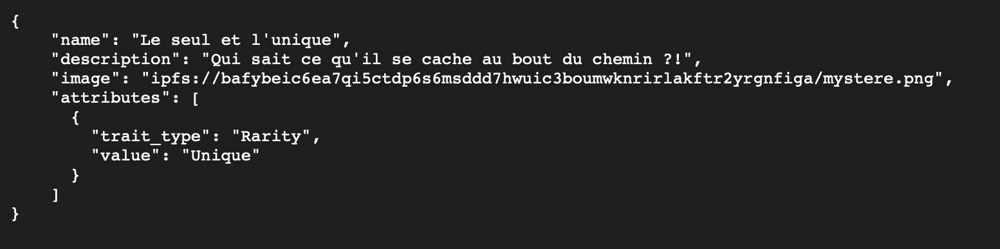
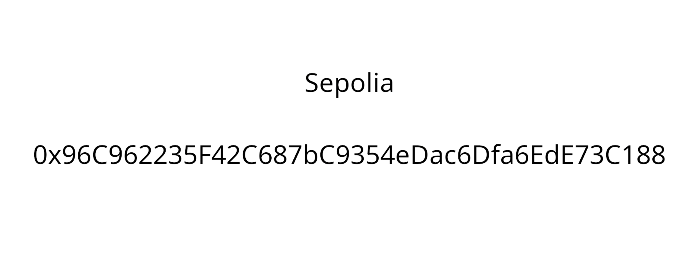
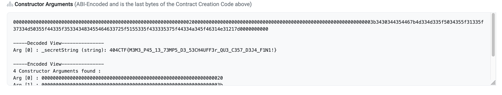

# Art - Intro, 100 points

***

Nous avons un [mystérieux fichier](./memorandum.txt) `.txt` à notre disposition contenant des valeurs hexadécimales (des chiffres et des lettres entre a et f). 

On lance [cyberchef](https://gchq.github.io/CyberChef/) pour voir si on arrive à en tirer quelque chose.  

Tiens donc, un URL en bas de page, ca semble trop beau pour être vrai d'autant plus que l'on n'a pas touché à du web3 pour l'instant. Et en effet on tombe dans [le panneau](https://www.youtube.com/watch?v=dQw4w9WgXcQ).

Bon on regarde quelques lignes au dessus, et on voit un lien IPFS: `/ipfs/bafybeia5g2umnaq5x5bt5drt2jodpsvfiauv5mowjv6mu7q5tmqufmo47i/metadata.json`.  Voilà qui pourrait nous intéresser. 
Ce n'est visiblement par un URL classique, on se rensigne donc sur [les adresse IPFS](https://docs.ipfs.tech/how-to/address-ipfs-on-web/) dont le format est `https://ipfs.io/ipfs/<CID>`.

Il ne nous reste donc plus quà accéder à l'addresse suivante pour découvrir le contenu du fichier `json`:
https://ipfs.io/ipfs/bafybeia5g2umnaq5x5bt5drt2jodpsvfiauv5mowjv6mu7q5tmqufmo47i/metadata.json

Celui ci contient les informations suivantes:

Il y'a un lien IPFS vers un fichier `mystere.png`. Allons voir de quoi il s'agit:

Surprenant, on nom qui ne m'évoque rien avec une addresse Ethereum. Sepolia est en fait un test testnet dont l'URL est le [suivant](https://sepolia.etherscan.io). En y renseignant l'addresse ethereum a notre disposition (0x96C962235F42C687bC9354eDac6Dfa6EdE73C188) on découvre les informations liées au contrat et en cherchant un peu sur le site on tombe sur ça (dans l'onglet code du contract):

***

Voir le flag :

***FLAG: 404CTF{M3M3_P45_13_73MP5_D3_53CH4UFF3r_QU3_C357_D3J4_F1N1!}***

